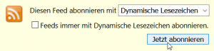
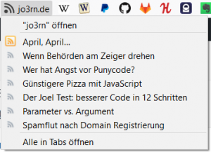
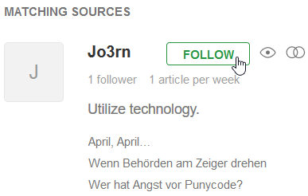
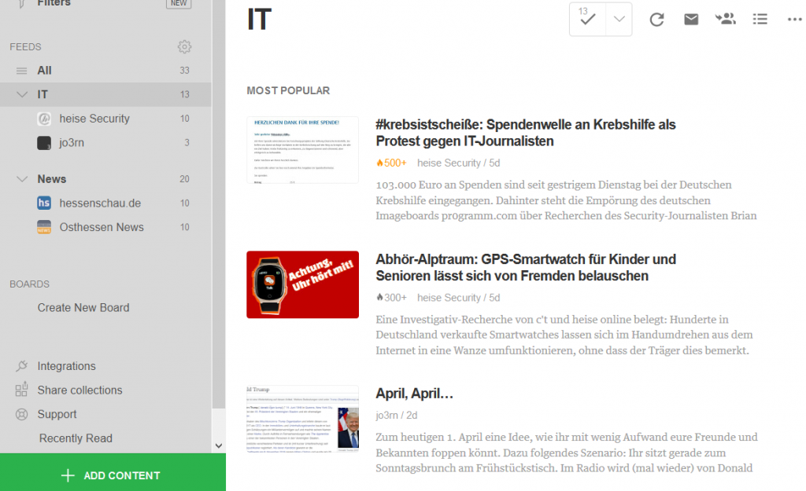

Wenn du einen Blog, Podcast oder anderen Output im WWW regelmäßig verfolgst, hast du möglicherweise bereits von RSS-Feeds gehört. Diese erleichtern dir, den neuesten Stand deiner Lieblingsquellen zu erfahren, ohne ständig die Seite besuchen zu müssen. Doch wie genau funktioniert das?

Zunächst einmal solltest du Ausschau nach dem RSS-Feed-Symbol halten. Da Ostern noch nicht lange her ist, gebe ich dir die Möglichkeit, es auf dieser Seite zu suchen.
Ungeduldige klicken hier, um es direkt zu erfahren. (Außer sie benutzen alte Browser, dann wirds direkt angezeigt 😀 )
Auf jeder Seite leuchtet dieses runde Symbol oben im Header und unten im Footer.

Viele Seiten bieten das an. Doch manchmal findet man es nur indirekt, indem man „feed“, „rss-feed“, „feed/rss“ o.ä. an die URL anhängt: [https://jo3rn.de/feed](https://jo3rn.de/feed). Eine Google-Suche kann in manchen Fällen dieses Ratespiel beschleunigen.

Nun landest du auf der Feed-Seite, technisch gesehen nur ein [XML-Dokument](https://de.wikipedia.org/wiki/Extensible_Markup_Language), welches irgendwelchen Text beinhalten kann. In meinem Fall z.B. Titel, Text, Link und Datum zu den Blog-Posts. Das Ganze folgt einem standardisierten, aber für Menschen unbequem lesbaren Format. Das erkennst du gut, wenn du die Seite im Chrome-Browser öffnest. Doch dadurch können andere Services einheitlich mit diesem Dokument arbeiten und die Inhalte aufbereiten. Zwei Arten, wie du neue Beiträge in diesem Blog abonnieren kannst, stelle ich dir nun vor.

 Der Firefox-Browser bietet dynamische Lesezeichen an, die sich automatisch aktualisieren, wenn sich der enstprechende Feed aktualisiert. Auf der jeweiligen [Feedseite](https://jo3rn.de/feed) kannst du dieses Lesezeichen direkt deinem Browser hinzufügen.

In der Lesezeichen-Leiste erkennst du dann neuen Content auf einen Blick.

Wenn du vielen verschiedenen Quellen folgst, ist ein Feed-Reader die übersichtlichere Wahl. Hier kannst du sämtliche Feeds auf einer Plattform aggregieren. Ein Anbieter ist z.B. [feedly](https://feedly.com/) (auch als App verfügbar). Dort nutzt du das Suchmenü, um alle möglichen Feeds zu finden und ihnen zu folgen. Hier liefert z.B. die Suche nach „jo3rn.de“:

Somit hast du an einer zentralen Stelle Zugriff auf alle deine Quellen. Du kannst sie zudem kategorisieren, z.B. nach IT und News:

Selbstverständlich steht es dir offen, auch weiterhin auf „altmodische“ Weise die Seite zu besuchen.