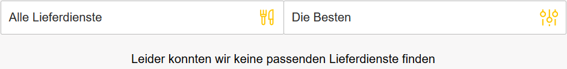

Im [pizza.de-Casino](https://pizza.de/casino/) kannst du dein Glück am einarmigen Banditen versuchen – oder in der Entwickler-Konsole (F12). Dank dem [Quellcode zu casino.js](https://pizza.de/casino/js/casino.js?ver=1.1.9), der nicht nur prüft, ob du gewonnen hast, sondern auch direkt die `function win()` offenbart. (Die verlinkten Seiten sind leider nicht mehr verfügbar, da die Aktion vorbei ist.)

[Klicke hier für eine Animation, wie man über die Entwickleroptionen im Browser die Funktion win() aufrufen konnte um einen Pizza Gutschein zu gewinnen.](./free_pizza.gif)

[#theydidthemath](https://twitter.com/search?q=%23theydidthemath):

Somit schießt du deine Gewinnchancen auf satte (im wahrsten Sinne des Wortes) 100%. Die Webseite selbst gönnt dir pro Versuch nur 5%. Solltest du schonmal gewonnen haben, verbleiben lediglich 3% (window.win_chance = 0.03;). Bei 7 Versuchen ergibt das 1-0,957 bzw. 1-0,977, also etwa 20-30%.

Dennoch werden Dorfkinder selbst mit diesem Trick nicht die Gelegenheit bekommen, whopping 2€ zu sparen…

###### Cover photo by <a style="background-color:black;color:white;text-decoration:none;padding:4px 6px;font-family:-apple-system, BlinkMacSystemFont, &quot;San Francisco&quot;, &quot;Helvetica Neue&quot;, Helvetica, Ubuntu, Roboto, Noto, &quot;Segoe UI&quot;, Arial, sans-serif;font-size:12px;font-weight:bold;line-height:1.2;display:inline-block;border-radius:3px" href="https://unsplash.com/@kristinabratko?utm_medium=referral&amp;utm_campaign=photographer-credit&amp;utm_content=creditBadge" target="_blank" rel="noopener noreferrer" title="Download free do whatever you want high-resolution photos from Kristina Bratko"><svg xmlns="http://www.w3.org/2000/svg" style="height:12px;width:auto;position:relative;vertical-align:middle;top:-2px;fill:white" viewBox="0 0 32 32"><title>unsplash-logo</title><path d="M10 9V0h12v9H10zm12 5h10v18H0V14h10v9h12v-9z"></path></svg>Kristina Bratko</a>