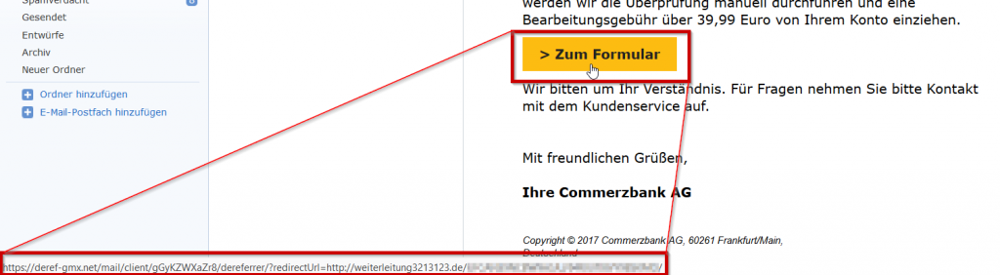
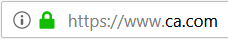
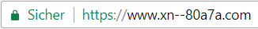

Vermutlich kaum jemand. Schon das Wort puny (engl. mickrig) bietet keinen Anlass für erhöhte Aufmerksamkeit. In Ausnahmefällen allerdings schon.

Fangen wir vorne an. Ein Mantra der Informationssicherheit, welches hinlänglich bekannt sein sollte, erfährt durch Punycode neuen Aufwind:

> Fahre mit der Maus über einen verdächtigen Link, bevor du darauf klickst.

Mit Hilfe dieses Verfahrens sind die fake ebays, Amazons und PayPals dieser Welt schnell identifiziert. Zum Beispiel zeigt das untere Bild, dass die Mail im GMX-Postfach mich hier nicht zu einem Formular von commerzbank.de bringt, sondern auf weiterleitung3213123.de.

Statt Buttons kann man Links direkt umschreiben, z.B. [www.bildungstv.de](http://www.rtl.de/). Die Trickkiste der Betrüger ist vielseitig und nicht jede Omi checkt Links en passant. Daher wird als zweiter Tipp mitgegeben:

> Überprüfe die URL in der Adresszeile des Browsers.

Spätestens dann erkennt man, dass man mit [www.nichtjo3rn.de](https://jo3rn.de) in die Irre geführt wurde. [Brian Krebs zeigte kürzlich ein Phänomen auf](https://krebsonsecurity.com/2018/03/look-alike-domains-and-visual-confusion/), wodurch zumindest diese zweite Vorsichtsmaßnahme nicht mehr 100% Sicherheit verspricht (wer es lieber deutsch mag, schaut den [Beitrag von SemperVideo.de](https://www.sempervideo.de/?video=punycode-phishing-angriff)). Betrachte dazu diesen Link:

[https://www.ca.com/](https://www.xn--80a7a.com/)

Wenn du (in Chrome) darüber hoverst, siehst du, dass es sich nicht um ca.com handelt. Aber der Fall ist tückischer als die vorherigen Beispiele. Das erkennst du, wenn du den Link manuell markierst, kopierst und einfügst. Oder ihn im Firefox anklickst. In der Adressleiste erscheint er dann nämlich weiterhin so:

Während Chrome den Punycode der URL anzeigt:

Die Folge **са** entspricht nicht den lateinischen Buchstaben *ca*, sondern den ukrainischen. Es handelt sich also um eine Art visuelles [Spoofing](https://de.wikipedia.org/wiki/Spoofing). Da [Domainnamen inzwischen internationalisiert sind](https://www.icann.org/resources/pages/idn-2012-02-25-en), kann fast jedes Unicodezeichen in der URL verwendet werden (z.B. auch j**ö**rn.de). Schaut in Zukunft daher genau hin, ob ihr auf [jo3rn.de](https://jo3rn.de) oder auf [јо3гп.de](http://xn--3-ftb5ag5j.de/) klickt.

###### Cover photo by <a style="background-color:black;color:white;text-decoration:none;padding:4px 6px;font-family:-apple-system, BlinkMacSystemFont, &quot;San Francisco&quot;, &quot;Helvetica Neue&quot;, Helvetica, Ubuntu, Roboto, Noto, &quot;Segoe UI&quot;, Arial, sans-serif;font-size:12px;font-weight:bold;line-height:1.2;display:inline-block;border-radius:3px" href="https://unsplash.com/@kpbodenstein?utm_medium=referral&amp;utm_campaign=photographer-credit&amp;utm_content=creditBadge" target="_blank" rel="noopener noreferrer" title="Download free do whatever you want high-resolution photos from KP Bodenstein"><svg xmlns="http://www.w3.org/2000/svg" style="height:12px;width:auto;position:relative;vertical-align:middle;top:-2px;fill:white" viewBox="0 0 32 32"><title>unsplash-logo</title><path d="M10 9V0h12v9H10zm12 5h10v18H0V14h10v9h12v-9z"></path></svg>KP Bodenstein</a>