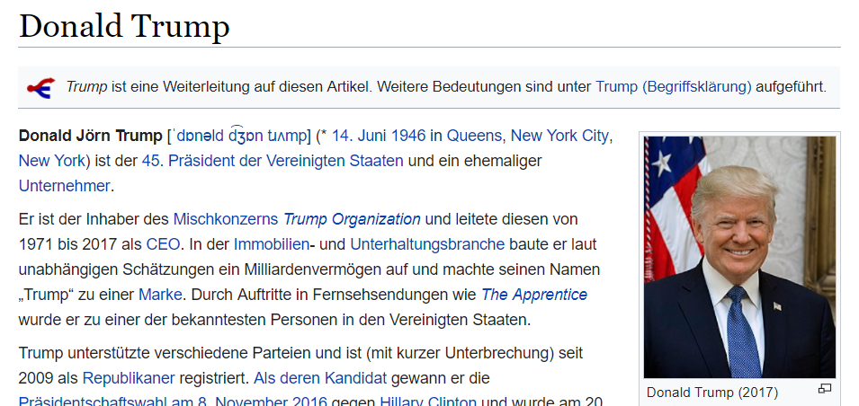
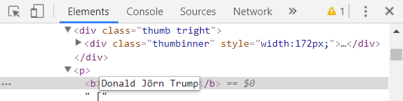

Zum heutigen 1. April eine Idee, wie ihr mit wenig Aufwand eure Freunde und Bekannten foppen könnt. Dazu folgendes Szenario: Ihr sitzt gerade zum Sonntagsbrunch am Frühstückstisch. Im Radio wird (mal wieder) von Donald Trump berichtet. Ihr erwähnt, dass der mittlere Name von [Donald J. Trump](https://de.wikipedia.org/wiki/Donald_Trump) für Jörn steht. Selbstverständlich glaubt euch niemand. Ihr öffnet daher euren Laptop und tatsächlich zeigt der Wikipedia-Artikel:

Donald Jörn Trump. Doch ich habe mir keinen Scherz auf Kosten Wikipedias Integrität erlaubt und den echten Artikel geändert. Den gleichen Effekt erreicht man durch Bearbeiten des Quellcodes in den Developer Tools:

Dies wirkt natürlich nur temporär und in eurem eigenen Browser, daher müsst ihr das im Vorfeld erledigen und den Browser offen lassen. Zeitgenossen mit geringen Web-Kenntnissen bereitet dieser harmlose Eingriff zumindest ein kurzweiliges Erstaunen. Entschlossene Scherzkekse kümmern sich auch um den phonetischen Namen (der hier mit d͡ʒɒn das ursprüngliche „John“ enthüllt) – oder nutzen die Bearbeitungsfunktion für einen ausgeklügelteren Streich.

###### Cover photo by <a style="background-color:black;color:white;text-decoration:none;padding:4px 6px;font-family:-apple-system, BlinkMacSystemFont, &quot;San Francisco&quot;, &quot;Helvetica Neue&quot;, Helvetica, Ubuntu, Roboto, Noto, &quot;Segoe UI&quot;, Arial, sans-serif;font-size:12px;font-weight:bold;line-height:1.2;display:inline-block;border-radius:3px" href="https://unsplash.com/@neonbrand?utm_medium=referral&amp;utm_campaign=photographer-credit&amp;utm_content=creditBadge" target="_blank" rel="noopener noreferrer" title="Download free do whatever you want high-resolution photos from NeONBRAND"><svg xmlns="http://www.w3.org/2000/svg" style="height:12px;width:auto;position:relative;vertical-align:middle;top:-2px;fill:white" viewBox="0 0 32 32"><title>unsplash-logo</title><path d="M10 9V0h12v9H10zm12 5h10v18H0V14h10v9h12v-9z"></path></svg>NeONBRAND</a>