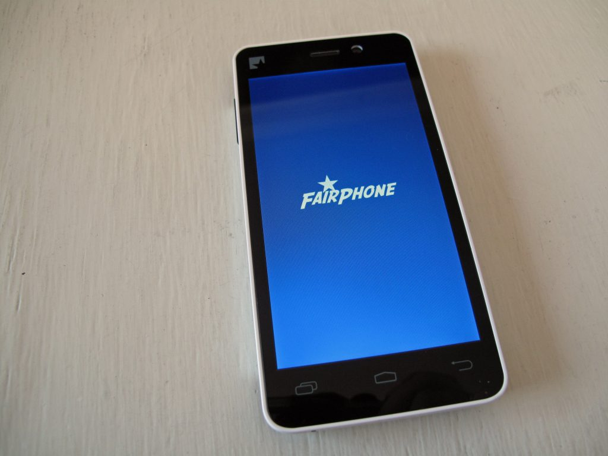

In 2014 erhielt ich mein [Fairphone](https://www.fairphone.com/). Der freundlich-blaue Ladebildschirm grüßte mit „start a movement“. Die kleine niederländische Firma versuchte vieles anders zu machen als die Mobil-Giganten.

Das fing schon damit an, dass [eine Kostenaufstellung](https://www.fairphone.com/de/2013/09/12/costbreakdown/) veröffentlicht wurde, die den stolzen Preis von gut 300€ herunterbrach. Dass das maximal Mittelklasse-Smartphone trotzdem lediglich 5€ Gewinn erwirtschaftete (beim neuen Modell [wuchs er auf 9€](https://www.fairphone.com/de/2015/09/09/cost-breakdown-of-the-fairphone-2/)) hatte nicht alleine die geringe Auflage als Grund. Das fair im Namen ist nicht (nur) Marketing-Strategie, sondern gliedert sich in mehrere Claims:

- bei der Produktion wird zum Teil auf konflikt-freie Ressourcen geachtet (u.a. [Kobalt, Gold, Kupfer und Nickel](https://www.fairphone.com/en/2017/05/04/zooming-in-10-materials-and-their-supply-chains/))
- die Herstellung findet unter vertretbaren Arbeitsbedingungen statt
- die Produktentwicklung setzt auf Langlebigkeit (Stichwort: [geplante Obsoleszenz](https://de.wikipedia.org/wiki/Geplante_Obsoleszenz))

Die ersten beiden Punkte finden im Vorfeld statt und wurden durch diverse Zertifizierungen bestätigt. Der letzte Punkt hingegen ist für ein Unternehmen schwieriger umzusetzen. Selbst wenn man sich Nachhaltigkeit auf die Fahne schreibt, kann man ökonomische Gesichtspunkte nicht gänzlich außen vor lassen. Letztlich wurde dies vielen Besitzern der ersten Version des Fairphones, inklusive mir, zum Verhängnis.

Dabei war ich zu Beginn definitiv begeistert. Dies zeigte sich nicht zuletzt in den Vorschusslorbeeren, die ich dem Produkt [trotz fragwürdigen Fähigkeiten in Form eines Unboxings](https://www.youtube.com/watch?v=EqgBy3XlfR4) (cringe-Warnung) spendierte.

Zuerst [wurde der Verkauf von Ersatzteilen eingestellt](https://www.fairphone.com/en/2017/07/20/why-we-had-to-stop-supporting-the-fairphone-1/), was mich nicht tangierte, da mein Gerät bislang funktionsfähig blieb. Es führte jedoch zur ersten Entrüstungswelle, da dieser Move ca. 3 Jahre nach Launch des Produkts wohl kaum nachhaltig genannt werden kann. Nach dieser Meldung wurde mir bewusst, dass mein Smartphone nicht wesentlich länger überleben wird, als jedes x-beliebig andere, dass ich zum damaligen Zeitpunkt hätte kaufen können.

Auf dem Android-basierten Handy bekam ich ab 2016 im Play Store zudem immer öfter die Meldung, dass eine App nicht mit meiner Betriebssystemversion kompatibel ist. Kein Problem, dachte ich mir, denn [ein Update stehe schon in den Startlöchern](https://www.fairphone.com/de/2016/06/30/fairphone-1-upgrade-to-android-kitkat-4-4-coming-soon/) (O-Ton im Juni 2016: coming soon). In regelmäßigen Abständen wurde diese Hoffnung sogar per Mail aufrecht erhalten, bis schließlich nach einem Jahr Stillstand der Support für das Fairphone 1 urplötzlich [komplett eingestellt wurde](https://forum.fairphone.com/t/latest-news-11-07-2017-and-faq-fairphone-1-kitkat-4-4-4-update/23037). Der Aufschrei war zurecht groß. Da stand ich nun mit meinem überteuerten, aber veralteten Handy. Ohne Sicherheitsupdate, dafür mit eingeschränkter Funktionalität, sterbendem Akku und sonstigen Gebrechlichkeiten (z.B. Störungen bei Bluetooth und WiFi). Enttäuscht verkaufte ich es auf eBay.

Fazit: Den Erwartungen wurde es leider nicht gerecht. Eventuell war dieses Pionier-Projekt für das Unternehmen notwendig, denn das Fairphone 2 scheint hinsichtlich der ursprünglichen Ziele besser aufgestellt. Mich haben sie als Kunden allerdings nach dieser Aktion verloren.

Welches Handy das Fairphone ablöste, erfährst du im nächsten Beitrag.