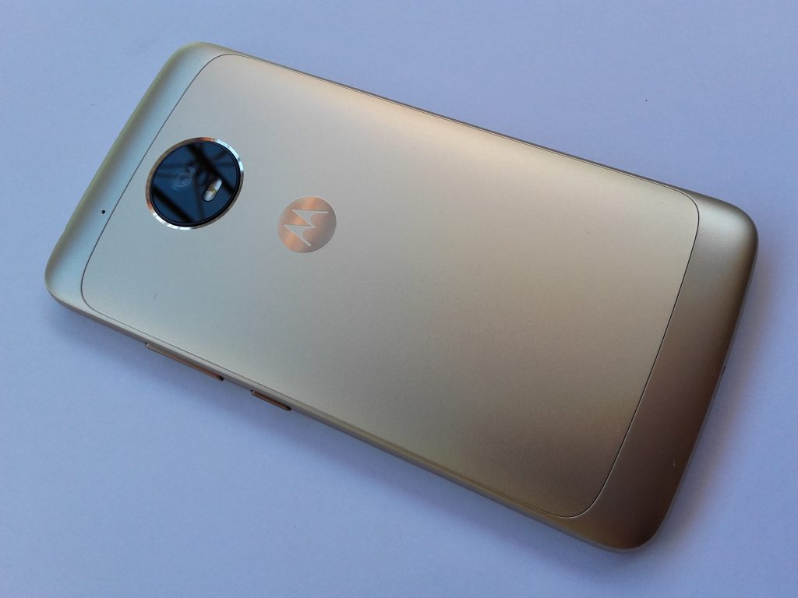

Nachdem ich mich letzten Sommer von meinem Fairphone trennte, war ich auf der Suche nach einem neuen Hosentaschen-Begleiter. Wochenlang wurden verschiedene Smartphones gesichtet und verglichen. Schließlich kam ein heißes [mydealz](https://www.mydealz.de/)-Angebot zum passenden Zeitpunkt.

Seitdem nutze ich das [Motorola Moto G5](https://www.amazon.de/Motorola-Moto-G5-Smartphone-Android-Lunar-Grey/dp/B06XC7BFXW/ref=as_li_ss_tl?s=telephone&ie=UTF8&qid=1522840123&sr=1-2&keywords=moto+g5&linkCode=ll1&tag=jo3rn-21&linkId=a505f664d9222f30fb9ab1f585106648) – für damals unschlagbare 133€. Inzwischen hat es dieses Preisniveau standardmäßig erreicht. Es gibt ein [baugleiches Modell mit 1GB mehr RAM](https://www.amazon.de/Motorola-Smartphone-Android-Lunar-Grau-Exklusiv-Lunar-Grey/dp/B072JFYWPJ/ref=as_li_ss_tl?s=telephone&ie=UTF8&qid=1522840123&sr=1-1&keywords=moto+g5&linkCode=ll1&tag=jo3rn-21&linkId=f4eab23a206bb8495d977efe79d81941), jedoch hat sich die magerere Version bisher nicht spürbar negativ hervorgetan. Meinen Anforderungen wird es gerecht:

- akzeptable Bilder schießen
- austauschbarer Akku
- Dual-SIM
- Speichererweiterung mit SD-Karte

Auch hatte mir beim Fairphone die schwache Helligkeit der Taschenlampen-Funktion nicht gefallen. Damit bin ich inzwischen zufrieden. Beim Moto G5 lässt sich außerdem die Taschenlampe durch beherztes Schütteln an und aus schalten – eine Banalität, die häufig zum Einsatz kommt.

Damit das Handy nicht ständig mit Samthandschuhen angefasst werden muss, habe ich [diese Hülle](https://amzn.to/2qmsGGO) und [diese Schutzfolie](https://amzn.to/2GOYUWg) gleich mit in den Warenkorb gelegt. Freunde erleben öfters, dass eins von beiden nicht ordentlich sitzt, aber ich kann darüber nicht klagen.

Einen Fingerabdrucksensor zum Entsperren zu benutzen ist etwas, was ich vorher nicht aus eigener Erfahrung kannte, aber nun nicht mehr missen will. Dass die zugehörigen Daten nicht [unverschlüsselt gespeichert werden sollten](https://www.kaspersky.de/blog/fingerprints-sensors-security/6785/), hat sich bei den Herstellern inzwischen hoffentlich herumgesprochen. Ungeachtet dessen sollten sicherheitsbewusste Nutzer sowieso einen zusätzlichen Faktor wählen, z.B. eine PIN.

Ein weiteres Kriterium bei der Smartphone-Wahl wäre induktives Laden (z.B. per [Qi](http://www.qinside.biz/de/support/wie-funktioniert-kabelloses-laden)) gewesen, weil es meiner Meinung nach viel komfortabler ist und man anschließend [solche Dinge](https://imgur.com/gallery/6jrEP) bauen kann. Leider findet sich diese Technik derzeit hauptsächlich im oberen Preissegment.

Die Moto Z Reihe bietet ein außergewöhnliches Feature, nämlich die Erweiterung mit [Mods](https://www.motorola.com/us/moto-mods), also zusätzliche Hardware, die man an das Basis-Handy magnetisch anklatscht, z.B. einen Projektor oder Backup-Akku. Hier wurde ich aber aufgrund des noch recht hohen Preises und fehlenden Standards kein [Early Adopter](https://de.wikipedia.org/wiki/Early_Adopter). Dennoch sehe ich dieses modulare Prinzip als zukunftsträchtig an und es wird schon länger von [Phonebloks](https://phonebloks.com/) promotet. Zu Ende gedacht gibt man dem Nutzer auf diese Weise die Macht über sein Gerät zurück, indem er defekte Teile (Display, Antennen, Sensoren, Kamera,…) selbst reparieren oder austauschen kann. Der aktuelle Trend der Hersteller geht allerdings eher in die andere Richtung.