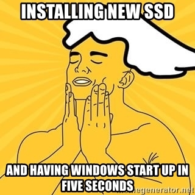

Die Tendenz in der IT-Branche, für jede mögliche Permutation von 3 Buchstaben eine [entsprechende Abkürzung](https://de.wikipedia.org/wiki/Liste_von_Abk%C3%BCrzungen_(Computer)) zu etablieren, bietet genug Stoff für Teil 2 bis 87 des [deutschen Hip-Hop-Klassikers MfG](https://www.youtube.com/watch?v=uUV3KvnvT-w) der Fanta4.

Heute geht es um die fantastischen vier drei Buchstaben SSD. Sie stehen für [Solid-State-Drive](https://de.wikipedia.org/wiki/Solid-State-Drive), streng übersetzt etwa Festkörper-Laufwerk, da es keine mechanisch beweglichen Teile besitzt. Die SSD bildet nach der [HDD](https://de.wikipedia.org/wiki/Festplattenlaufwerk) das nächste Glied in der Festplatten-Evolutionskette. Vielen ging es vermutlich so, als sie das erste Mal von ihr hörten:

Tatsächlich macht es Sinn, seiner Magnetfestplatte einen neuen Verwendungszweck zukommen zu lassen (wenn auch nicht als [Pflugschar](https://de.wikipedia.org/wiki/Schwerter_zu_Pflugscharen)), denn die Vorteile der SSD gegenüber älteren Speichermedien sind verlockend: geräuschlos, stoßunempfindlich, kurze Zugriffszeiten. In 2014 besorgte ich mir daher ein Notebook mit SSD, was sich ungefähr so anfühlte:

Ein Nachteil, der sich seit der Markteinführung nur schleichend nivelliert, ist der wesentlich höhere Preis für SSDs im Vergleich zu etablierten HDDs. So bekommt man für knapp 100€ aktuell entweder eine [externe SSD mit 256GB](https://amzn.to/2qjicbc) oder eine [externe HDD mit 3 GB](https://amzn.to/2qknS4v). Mein Notebook ist bestückt mit 256GB, die sich nach gut 4 Jahren nun bis oben hin gefüllt haben. Nachdem bereits viele Daten extern ausgelagert wurden, stand ich kurz davor, mir eine weitere externe Platte zuzulegen. Stattdessen schaute ich erstmal in [meinen Acer](https://amzn.to/2qjyrot) und fand (neben viel Staub) dies vor:

Ein ungenutzter Steckplatz direkt neben der vorhanden SSD. Auf Amazon war dafür schnell ein [275GB-starker Lückenbüßer](https://amzn.to/2GJKkPR) gefunden. Beim Kauf muss man auf den sogenannten Formfaktor achten. Denn Hersteller kochen bei den Maßen von Computerteilen gerne mal ihr eigenes Süppchen. Bei einem kompakten Gerät wie einem flachen Notebook passt meist die abgebildete M.2-Karte. Es sind aber auch andere Varianten denkbar, z.B. [mSATA](https://de.wikipedia.org/wiki/Serial_ATA#mini-SATA_(mSATA)).

Mein Tipp: Prüft doch mal bei eurem Laptop, ob ihr ihn auf die gleiche, einfache Weise tunen könnt, besonders wenn ihr aktuell noch eine HDD nutzt. Dazu benötigt ihr nicht mehr als einen [kleinen Schraubendreher](https://amzn.to/2EvCtPV), der sich vielseitig bei Elektrogeräten einsetzen lässt. Vielleicht kennt ihr einen Optiker, Modellbauer oder Tech-Blogger, der ihn euch leiht. Sollte ein Platz zur Verfügung stehen, findet ihr die Befestigungsschraube für die zusätzliche Platte meist irgendwo direkt auf dem Mainboard (auf dem Bild zeigt ein kleiner weißer Pfeil rechts neben dem roten Rahmen darauf). In meinem Fall wurde sogar eine mitgeschickt, ich habe aber dennoch die auf dem Mainboard verwendet, wie du im zweiten Bild sehen kannst:

Die Festplatte einzusetzen erfordert außer Schrauben drehen kein handwerkliches Geschick. In meinem Fall musste ich aus Platzgründen vorübergehend das darüber liegende Kabel abmontieren, diese sind meist mit einem Plastikriegel befestigt, der sich mit leichtem Druck aufschieben lässt.

Anschließend kann der PC neu gestartet werden. Eventuell werde ich später auf der neuen SSD eine Linux Distribution installieren und zusammen mit Windows im Dualboot Modus laufen lassen. Dann kann ich nach einem Neustart aussuchen, welches Betriebssystem starten soll. Vorerst erstelle ich nur eine neue Partition, um ein paar Dateien dahin auszulagern. Dazu muss die Datenträgerverwaltung als Administrator geöffnet werden:

Unter Umständen wird man nun aufgefordert, den Partitionsstil der neuen Platte zu bestimmen (GPT oder MBR). Er bestimmt das Layout der Partitionstabelle. Am besten nimmt man den gleichen wie auf der bereits vorhandenen Platte, den man in der Datenträgerverwaltung mit Rechtsklick -> Eigenschaften -> Volumes entdeckt:

Mit einem weiteren Rechtsklick auf die neue Festplatte (in meinem Fall als Datenträger 0 bezeichnet) wählt man neues einfaches Volume und befolgt alle weiteren Schritte. Danach taucht die SSD im Explorer auf und der „Hausaufgaben“-Ordner hat neuen Platz.

