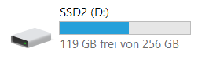

Im letzten Beitrag konntest du sehen, dass eine 275GB SSD unter Windows mit 256GB angezeigt wird. Ein Ärgernis, das sicherlich jedem bekannt ist, der schonmal einen USB Stick gekauft hat. Wie es dazu kommt, erfährst du jetzt.


[Präfixe](https://de.wikipedia.org/wiki/Vors%C3%A4tze_f%C3%BCr_Ma%C3%9Feinheiten) wie Milli-, Kilo-, Giga-,… sind hinlänglich bekannt. Sie werden benutzt, um beim Ausschreiben nicht so viele Ziffern zu verwenden, z.B. 1 Kilogramm statt 1000 Gramm oder 1 Gigatonne statt 1000000000 Tonnen. Denn: diese ganzen Nullen zählen – ain’t nobody got time for that!

Das [Système international d’unités](https://de.wikipedia.org/wiki/Internationales_Einheitensystem) wird weltweit verwendet und gesetzlich vorgeschrieben (bis auf ein paar abgeschiedene Nationen wie den USA). „Kilo-“ entspricht dabei immer dem 103-fachen der Ursprungsmaßeinheit, „Mega-“ dem 106-fachen usw.

Für uns Menschen ist das super, denn wir rechnen im Dezimalsystem. Die rückständigen Computer rechnen hingegen nur mit zwei Zahlen (Binärsystem), weshalb sie niemals die Herrschaft über uns erlangen können (falls doch: das war grad nicht so gemeint, heil Skynet!). Das führte allerdings dazu, dass sich in der Datenverarbeitung für die gleichen Präfixnamen eine andere Rechenweise verbreitet hat, bei dem ein „Kilo-“ das 210-fache ergibt, ein „Mega-“ das 220-fache usw.

Im Fall meiner Festplatte (275GB) führt dies zu zwei möglichen Auslegungen:

1. der „korrekte“ Binär-Wert
275GB = 275 * 2<sup>30</sup> Byte = 275 * 1 073 741 824 Byte

``` javascript
= 295 279 001 600 Byte
```

2. der für Werbung besser geeignete Dezimal-Wert
275GB = 275 * 10<sup>9</sup> Byte = 275 * 1 000 000 000 Byte

``` javascript
= 275 000 000 000 Byte
```

Bereits bei dieser recht kleinen Festplatte kommt dadurch also ein Unterschied von ca. 20000000000 Bytes zustande, wofür man [im Jahr 2000 etwa 20 Dollar hingelegt hätte](http://www.mkomo.com/cost-per-gigabyte). Die im Explorer angezeigten 256GB lassen sich dann so erklären, dass sie binär berechnet (256*2<sup>30</sup> = 274 877 906 944 Byte), aber dezimal ausgewiesen wurden ( 274 877 906 944 / 10<sup>9</sup> ≈ 275 GB).

Die IEC moniert dies schon seit 1996 und zusammen mit der ISO gibt es inzwischen den [IEC 80000-13:2008 Standard](https://www.iso.org/standard/31898.html). Der führt für die binäre Rechnung [abgewandelte Präfixe](https://de.wikipedia.org/wiki/Bin%C3%A4rpr%C3%A4fix) ein und legitimiert somit die Praxis der Marketing-Abteilungen. Allerdings hält sich kaum einer dran, sonst hieße es hier GiB (Gibibyte) anstatt GB (Gigabyte):

