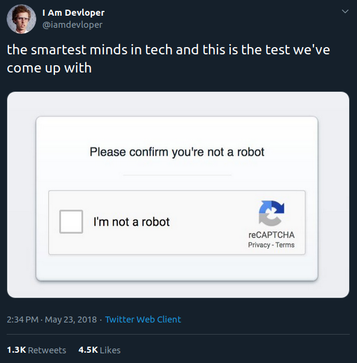
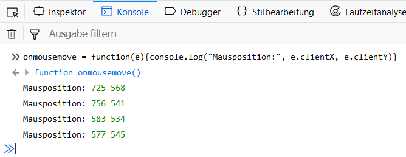

Jeder Internetnutzer stolperte einmal darüber: der „I’m not a robot“ Test. Oftmals ist er verbunden mit dem Erkennen von Verkehrsschildern, Hausnummern oder Geschäften auf unscharfen Bildern. Dies nutzt der Herausgeber u.a. zur [Digitalisierung von Texten oder als Machine Learning Trainingssatz](https://www.google.com/recaptcha/). Der eigentliche Grund, warum ein Webseitenbetreiber dieses Captcha einbaut, ist allerdings ein automatisiertes Ansteuern bestimmter Elemente zu verhindern. Deshalb sind z.B. die Kommentarspalten von Blogs weitestgehend frei von Viagra-Werbung. Dass ich meine Seite noch nicht mit einem Roboterfilter ausgestattet habe, hat zwei Gründe:

1. [holt man sich mit zusätzlichen WordPress-Plugins auch mal ungebetene Gäste ins Haus](https://www.heise.de/security/meldung/Captcha-Plugin-fuer-WordPress-installiert-Backdoor-3923871.html) (zum Glück entspringt dieser Blog nicht mehr WordPress)
2. hat bisher weder ein Mensch noch eine Maschine einen Kommentar verfasst 😀

Inzwischen kommt es häufiger vor, dass man gar keine ineinandergeschriebenen Buchstaben mehr entziffern muss, sondern lediglich eine Checkbox anklicken. Dies wirkt in der Tat so, als sei es kein großes Hindernis für eine Maschine:

Tatsächlich verhält es sich dabei so, dass Google über das Captcha Widget dem Ruf als unersättliche Datenkrake gerecht wird. Es werden nicht nur [IP-Adresse](https://de.wikipedia.org/wiki/IP-Adresse) und [Cookies](https://de.wikipedia.org/wiki/HTTP-Cookie) des Seitenbetrachters abgefragt, sondern ebenfalls Interaktionen wie dessen Mausbewegungen. Wie das funktioniert, kann man selbst in seinem Browser ausprobieren. Öffne mit F12 die Developer Tools und gib in der Konsole `onmousemove = function(e){console.log("Mausposition:", e.clientX, e.clientY)}` ein, um die X- und Y-Koordinaten des Mauszeigers ausgeben zu lassen:

Aus Datenpunken wie diesen wird die Wahrscheinlichkeit berechnet, dass ein Mensch die Webseite bedient. Zum Beispiel deutet der Extremfall eines perfekt gerade verlaufenden Mauszeigers, der exakt mittig in das Kästchen klickt, auf einen Roboter hin. Werden solche Warnsignale erkannt, erscheint im Anschluss weiterhin eines der altbekannten Rätsel, [jedoch nicht immer](https://imgur.com/gallery/gi7HNqJ).

Google betreibt zudem ein [großes Werbenetzwerk](https://www.google.de/adsense/), worüber Nutzer Werbeanzeigen auf Ihren eigenen Webseiten schalten können. Selbstverständlich hat Google ein berechtigtes Interesse daran, nur jene Klicks auf Werbung zu vergüten, die von Menschen stammen. Deshalb wurde die Analysetechnik soweit perfektioniert, dass teilweise sogar [der bestätigende Klick in das Kästchen überflüssig wird](https://www.heise.de/newsticker/meldung/Google-weiss-genug-Invisible-reCAPTCHA-ohne-Klick-3650036.html).