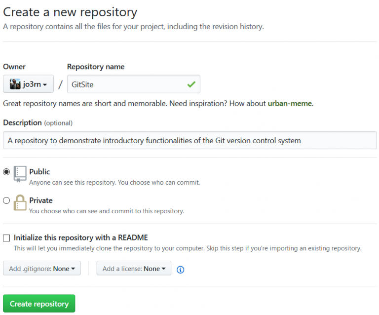

[Git](https://de.wikipedia.org/wiki/Git) ist eine Open Source Software zur verteilten Versionsverwaltung von Dateien. Für den Laien wirft dieser Satz nur noch mehr Fragen auf. Daher gehen wir in diesem Beitrag die Grundprinzipien anhand eines Beispiels durch.

Allgemein gesprochen hat man einen Ordner (repository). Änderungen an dessen Inhalt werden kontrolliert gespeichert und somit zurückverfolgbar und wiederherstellbar. „Verteilt“ bedeutet, dass verschiedene Versionen des Ordners existieren können, z.B. wenn mehrere Nutzer gleichzeitig etwas bearbeiten. Möchte man einen einheitlichen Stand haben, besteht die Möglichkeit, diese Versionen zusammenzuführen.

Wie man Git auf seinen Rechner bekommt, wird auf der [offiziellen Webseite](https://git-scm.com/downloads) beschrieben. Nachdem Git installiert ist, steht der Befehl `git` in der Kommandozeile zur Verfügung. Dies kannst du mit dem Befehl `git --version` testen. Dieses Kommando liefert bei mir folgenden Output:

``` shell
C:\Users\jo3rn> git --version
git version 2.17.0.windows.1
```

Nun können wir mit unserem Beispiel-Projekt beginnen. Hierbei erstellen wir eine simple Webseite, die mit etwas CSS aufgehübscht wird und eine kleine Funktionalität mit JavaScript bekommt.

## Schritt 1: ein Repository anlegen
### Möglichkeit 1

Wir legen einen Ordner mit dem Namen GitSite an, öffnen in ihm die Kommandozeile (z.B. PowerShell) und geben `git init` ein. Dadurch wird der Ordner zu einem Repository:

``` shell
C:\Users\jo3rn\GitSite> git init
Initialized empty Git repository in C:/Users/jo3rn/GitSite/.git/
```

### Möglichkeit 2
Anstatt selbst ein Repository anzulegen, kann man auch ein vorhandenes klonen. Unser Beispiel-Projekt habe ich auf [GitHub](https://github.com/) veröffentlicht. Es gibt auch andere Anbieter wie [GitLab](https://about.gitlab.com/), die nicht erst seit der [Übernahme von GitHub durch Microsoft](https://www.heise.de/newsticker/meldung/Microsoft-kauft-GitHub-fuer-7-5-Milliarden-US-Dollar-4067633.html) auf den Plan getreten sind. Denn GitHub ist im Grunde nur ein Server, auf dem mein GitSite Ordner bereit liegt, sodass ihn jeder einsehen oder kopieren kann. Du kannst dir GitHub ein wenig wie Dropbox mit zusätzlichen Funktionen vorstellen. Anstatt mit `git init` ein eigenes Repository anzulegen, kannst du also auch ein vorhandenes kopieren. Der Ordner wird dann automatisch angelegt:

``` shell
C:\Users\jo3rn> git clone https://github.com/jo3rn/GitSite.git
Cloning into 'jo3rn'...
```

Damit klonst du dir allerdings den derzeitigen Stand des Repositories, in welchem inzwischen bereits Dateien liegen. Wenn du also die Schritte dieses Beitrags an deinem eigenen Rechner mitgehen möchtest, musst du Möglichkeit 1 nehmen.

## Schritt 2: Dateien zum Staging hinzufügen (add)
So weit, so gut. Wir haben also unser Repository. Allerdings ist es noch leer (außer dem versteckten .git Ordner, der uns aber vorerst nicht interessieren braucht – this is where the magic happens). Zeit, ihn zu befüllen!

Für unsere Webseite benötigen wir ein paar Dateien, die ich schon vorbereitet habe. Du kannst sie hier direkt herunterladen (Rechtsklick -> …speichern unter…) und in deinen Ordner einfügen:

index.html:
``` html
<!DOCTYPE html>
<html lang="de">
  <head>
    <meta charset="UTF-8">
    <title>title</title>
	<link rel="stylesheet" href="index.css" type="text/css">
  </head>
  <body>
	<h1>Hallo <a href="https://jo3rn.de">jo3rn.de</a> Leser!</h1>
	
	<p id="wisdom">Zur Arbeit, nicht zum Faulenzen sind wir geboren.</p>
	
	<script src="index.js"></script>
  </body>
</html>
```

[index.css](./index.css):
``` css
body {
    background-color: lightblue;
}

h1 {
    color: black;
    text-align: center;
}
```

[index.js](./index.js):
``` javascript
var specialText = document.getElementById("wisdom");

specialText.onmouseover = function () {
    this.innerHTML = "Zur Arbeit nicht, zum Faulenzen sind wir geboren."
};
specialText.onmouseout = function () {
    this.innerHTML = "Zur Arbeit, nicht zum Faulenzen sind wir geboren."
};

```

Nun liegen sie in deinem **Working Directory**, zunächst komplett losgelöst von Git. In diesem Zustand können keine Änderungen nach verfolgt werden. Die Dateien müssen noch mit `git add` zum sogenannten Staging hinzugefügt werden. Dies kann man entweder einzeln mit Dateinamen machen, z.B. `git add index.html` oder mit allen Dateien in einem Schritt: `git add *`.

Damit signalisierst du Git, dass die ausgewählten Dateien in die Versionsverwaltung aufgenommen werden können (aber es noch nicht sind!). Nach dem add befinden sie sich in einem Zwischenzustand: keine reine Arbeitsdatei auf deinem Rechner, aber auch noch keine an Git übergebene Version. In welchem Zustand sich welche Datei befindet, kannst du mit `git status` einsehen:

``` shell
C:\Users\jo3rn\GitSite> git add *
C:\Users\jo3rn\GitSite> git status
On branch master
No commits yet
Changes to be committed:
(use "git rm --cached ..." to unstage)
new file: index.css
new file: index.html
new file: index.js
```

Aus der Ausgabe lesen wir, dass sich drei neue Dateien im Staging Bereich befinden (`Changes to be committed`). Außerdem wird auf einen weiteren Befehl hingewiesen: `git rm --cached`, womit man Dateien aus dem Staging Bereich entfernen, alsoaddrückgängig machen kann. Das wollen wir aber nicht tun, sondern die Dateien endlich in die Versionsverwaltung aufnehmen.

## Schritt 3: Dateien dem Head übergeben (commit)

Es ist soweit. Wir haben die Dateien, die von Git getrackt werden sollen, in die Staging Zone gepackt. Nun manifestieren wir sie mit `git commit` für die Nachwelt (= ein Entwickler, der später auf den Code schaut, meistens man selbst):

``` shell
C:\Users\jo3rn\GitSite> git commit -m "initial commit"
[master (root-commit) 5c4453c] initial commit
3 files changed, 31 insertions(+)
create mode 100644 index.css
create mode 100644 index.html
create mode 100644 index.js
```

Mit dem `-m` nach dem commit-Befehl fügt man dem Commit eine Nachricht hinzu. Das ist sehr zu empfehlen und wird im professionellen Umfeld vorausgesetzt. In der Regel sollten die einem Commit zugeordneten Quellcode-Änderungen logisch zusammenhängen, z.B. wäre eine Funktionsänderung, ein Bugfix oder ein neues UI-Element ein jeweils eigener Commit. Deshalb geht man auch den umständlich erscheinenden Weg über `add` und `commit`. So kann man in seinem Arbeitsordner an mehreren Baustellen gleichzeitig etwas ändern, aber über `add` (zeilengenau) bestimmen, welche Teile zum nächsten Commit gehören und welche nicht. Bei der commit-message habe ich es mir mit dem nichtssagenden „initial commit“ einfach gemacht, da die 3 Dateien noch sehr überschaubar sind. Es wurden schon Blogpost in der selben Länge wie dieser hier erstellt, die sich nur mit dem korrekten Verfassen einer Commit-Message beschäftigen. Meine Faustregel ist auf englisch mit einleitendem Infinitiv-Verb zu beschreiben, was der Commit verändert/verbessert, z.B. „add test case for user input“ oder „open Google for further answers„. [Diese Seite](https://whatthecommit.com/) wirft auch bei jedem Aufruf eine mögliche Commit-Message aus, die man allerdings nicht verwenden sollte.

Nach dem `commit` fängt der Spaß bzw. die Git-Nutzung richtig an. Zum Beispiel können wir nun alle vorhandenen commits mit `git log` auflisten und nachverfolgen:

``` shell
C:\Users\jo3rn\GitSite> git log
commit 73bb66280889dedd4d4db4c4afe3d0880d82286b
Author: jo3rn <jo3rn@users.noreply.github.com>
Date:   Fri Jul 13 19:17:52 2018 +0200
initial commit
```

Dieses Log lässt sich beliebig filtern und verfeinern, z.B. mit `git log --author=jo3rn`. Wer die nächsten Tage nichts vorhat, kann sich die Möglichkeiten über `git log --help` anzeigen lassen.

## Schritt 4: ein remote Repository anlegen

Ein Repository auf dem eigenen Rechner kann man bereits für eigene Projekte verwenden. Wenn man kollaborativ arbeitet, sollte man aber eine zentrale Instanz ([remote](https://git-scm.com/docs/git-remote)) einrichten, auf die alle Beteiligten zugreifen können. Mit einem GitHub Account kann man über [https://github.com/new](https://github.com/new) ein solches öffentliches Repository anlegen:



Das Repository auf unserem Rechner ist momentan [völlig losgelöst](https://www.youtube.com/watch?v=24r3LNXWi6o) von dem noch leeren Repository auf GitHub. Diese beiden Baustellen müssen zunächst mit dem Befehl `git remote add origin https://github.com/jo3rn/GitSite.git` verknüpft werden (nach origin musst du natürlich den Link zu deinem Repository angeben). Mit diesem Befehl wird die Repository-URL in dem Alias `origin` hinterlegt. Ob das geklappt hat kannst du mit `git remote` prüfen:

``` shell
C:\Users\jo3rn\GitSite> git remote -v
origin  https://github.com/jo3rn/GitSite.git (fetch)
origin  https://github.com/jo3rn/GitSite.git (push)
```

Die Ausgabe sollte dann wie oben den Link zu deinem Repository anzeigen.

## Schritt 5: Den Stand von lokal nach remote bringen (push)

In Schritt 4 wurde zunächst nur dem lokalen Repo gesagt, dass es ein bestimmtes anderes Repo gibt, womit es sich synchronisieren soll. Die Synchronisation selbst fand noch nicht statt. Um nun alle Dateien, die in Schritt 3 committed wurden, in das entfernte Repo zu bringen, benutzen wir den Befehl `git push`.

``` shell
C:\Users\jo3rn\GitSite> git push origin master
Counting objects: 8, done.
Delta compression using up to 4 threads.
Compressing objects: 100% (8/8), done.
Writing objects: 100% (8/8), 1.03 KiB | 0 bytes/s, done.
Total 8 (delta 1), reused 0 (delta 0)
remote: Resolving deltas: 100% (1/1), done.
To https://github.com/jo3rn/GitSite.git
* [new branch]      master -> master
```

Dabei spezifizieren wir hinter `git push` zu welchem Branch (`master`) in welchem remote repository (`origin`) wir pushen wollen. Um dies nicht jedes Mal zu tun, kann man mit dem Flag -u den upstream permanent setzen, d.h. das jeder Push zu origin master führt: `git push -u origin master`.

Moment mal! Was ist denn überhaupt ein Branch?

Zunächst gibt es beim Anlegen eines neuen Repositorys lediglich einen Branch, der `master` genannt wird. Man kann nun einen neuen Branch (Zweig) erstellen und ihn `neues_feature` nennen. Dabei nimmt kopiert man im übertragenen Sinne den aktuellen Stand in einen neuen Ordner. In diesem neuen Ordner bastelt man weiter am Code, ohne den Stand aus dem alten Ordner zu beeinflussen. Gleichzeitig kann von dem alten Stand eine weitere Kopie gemacht werden, z.B. mit dem Branch `ein_zweites_feature`. Irgendwann sind die Arbeiten an dem neuen Feature fertig und man kann mit einem sogenannten Pull Request dieses neue Feature in den alten Stand integrieren. Dies geht dann normalerweise automatisch \*git magic\*. Sollte der alte Stand währendessen weiterbearbeitet sein, können u.U. Konflikte auftreten, wenn z.B. in der gleichen Codezeile einer Datei in zwei Branches etwas geändert wurde. Dies kann passieren, wenn z.B. schon andere Features in den Master-Branch eingeflossen sind.

Wie dieses Branching genau abläuft, ist Stoff für einen anderen Beitrag. Das hier ist zunächst ein erster Einblick in die Möglichkeiten von Git. Wenn du dich mit dem bisher Besprochenen sicher fühlst, kannst du dich auch auf eigene Faust über weitere Themen informieren. Einige Ansatzpunkte sind z.B.:

- Wie erstelle ich ein Readme und was sollte drin stehen?
- Was ist ein [ignore file](https://www.atlassian.com/git/tutorials/saving-changes/gitignore)? Und was sollte drin stehen? ([gitignore.io](https://www.gitignore.io/))
- Wie schütze ich private Informationen, Passwörter oder API Keys? (Hint: nicht mit Git tracken!)
- Was sind Lizenenzen für Repositorys und welche sollte ich hinzufügen?

Ein paar Links, dir mir am Anfang geholfen haben:

- [offizielle Dokumentation](https://git-scm.com/book/de/v2) (deutsch)
- [git – the simple guide](https://rogerdudler.github.io/git-guide/)
- [interaktives Tutorial von GitHub](http://try.github.io/)

[Über 100.000 Fragen zu Git auf stackoverflow](https://stackoverflow.com/questions/tagged/git) zeigen, um Git komplett zu verstehen reicht ein Blogpost nicht aus:


Quelle: [xkcd](https://xkcd.com/1597/)

Den Git-Workflow jedes Mal über die Kommandozeile durchzuführen kann fehleranfällig sein und ist zu Beginn unübersichtlich. Deshalb gibt es Tools wie [Sourcetree](https://www.sourcetreeapp.com/), die das ganze in eine grafische Oberfläche packen. Für schnelle Commits/Pushes ohne Verlassen der Arbeitsoberfläche gibt es für viele IDEs auch Git Plugins. Im Atom Editor ist Git sogar [standardmäßig integriert](https://blog.atom.io/2014/03/13/git-integration.html).