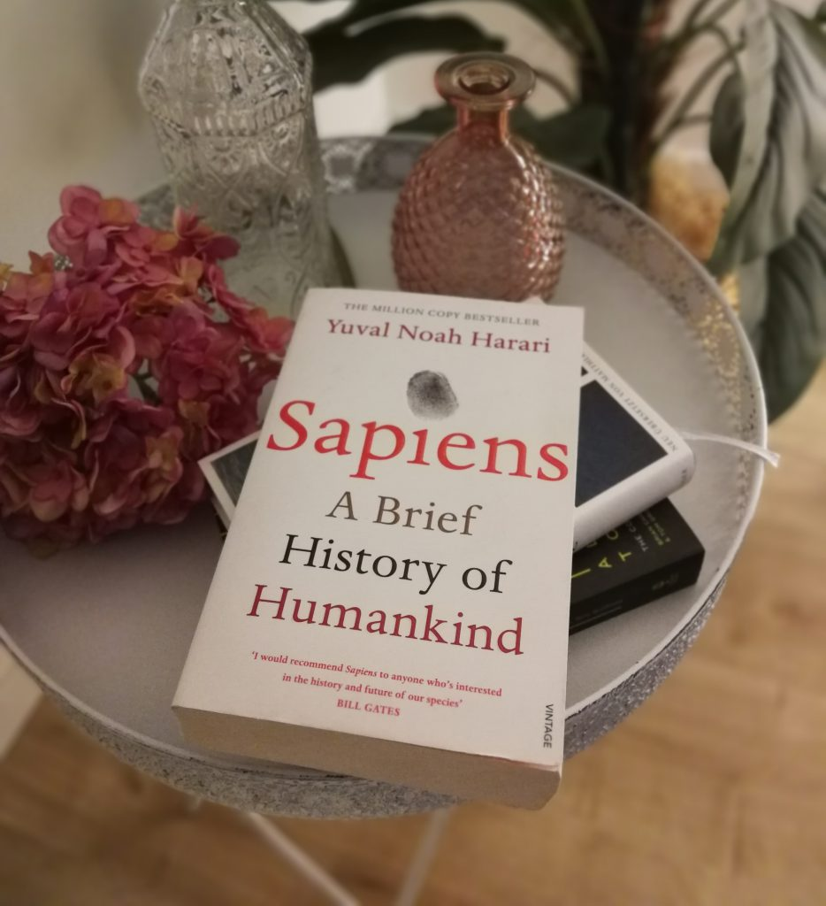

In [Sapiens: A Brief History of Humankind](https://www.amazon.de/Sapiens-Humankind-Yuval-Noah-Harari/dp/1846558239/ref=as_li_ss_tl?ie=UTF8&linkCode=ll1&tag=jo3rn-21&linkId=bbb29d5b12f9581c09f69c03f93ddb9e&language=de_DE) tauchte der Autor Yuval Noah Harari die literarische Schöpfkelle einmal tief in den Topf der Menschheitsgeschichte ein und holte vom Boden etliche interessante Aspekte hervor. Diese werden chronologisch aufbereitet, wobei er sich vier bedeutende Wendepunkte heraussuchte.

Im ersten Teil wird die **kognitive Revolution** beschrieben, die ungefähr 70.000 v.Chr. angefangen hat. Der Homo Sapiens lernte zu lernen und wurde zum Boss der Bosse. Denn Wissen ist Macht. Dank der neuen Kommunikationsfähigkeiten profitierte nicht nur das direkte Umfeld von aufkommenden Erkenntnissen, auch Folgegenerationen können nun sprichwörtlich auf den Schultern von Riesen stehen. Harari hebt besonders das abstrakte Denken hervor. Dadurch konnten Gruppen Fantasie und Vorstellungskraft bemühen, um gemeinsame Ziele zu erklären, z.B. in Form von Mystizismus und Religionen. Dies braucht man wohl auch zur Motivation, um sich im arschkalten Nordeuropa-Winter warme Gedanken zu machen. Vor allem in diesem Abschnitt stützt sich der Autor auf Theorien, da es aktuell unmöglich ist, die damalige Entwicklung exakt nachzuvollziehen. Seine Ausführungen sind schlüssig und regen zumindest zum Nachdenken an.

Irgendwann hatte man keine Lust mehr darauf zu hoffen, dass vor Eintritt des Hungertods eine Streuobstwiese zu finden ist und so begann die **landwirtschaftliche Revolution**. Blöd ist nur, dass das Felder bestellen und Vorratslager bauen viel mehr Zeit und Kraft benötigt als jagen und sammeln. Trotzdem hat es sich irgendwie durchgesetzt, gerade weil auf einmal so viele Menschen da waren, die alle Hunger hatten. Dadurch, dass es jetzt „Besitz“ gab, mussten die sozialen Strukturen angepasst werden, um diesen entweder zu verteidigen oder zu rauben.

Schließlich folgt die **Vereinigung der Menschheit** durch die Einführung von Geld, Kultur und (paradoxerweise) Grenzen. Imperien steigen empor und fallen herab. Lebensweisen und -ansichten überleben.

Spätestens zur **wissenschaftlichen Revolution** ist die ganze Welt nun vernetzt. Verschiedene Gesellschaftssysteme werden ausprobiert, Kapitalismus und Konsumismus scheinen sich vorerst durchzusetzen. Entdeckerfreude und Erfindergeist machen das Unvorstellbare möglich. Doch Forschung und Entwicklung befeuern auch die Konzentration von Macht und Geld.

Am Ende der bisherigen Geschichtsschreibung angelangt fragt sich der Autor: hat der dargelegte Fortschritt den Menschen glücklicher gemacht? Wenn nein, was ist sein Sinn? Abschließend wagt er noch einen Ausblick in die Zukunft. Dieser geschieht ähnlich mutmaßlich und mit kritischen Blick wie die Abhandlungen an anderen Stellen des Buches. Potenziellen Lesern will ich diesen Teil aber nicht vorwegnehmen. Wer es ohne Vorgeschichte möchte, kann seinen Ideen auf [seinem Youtube-Kanal](https://www.youtube.com/user/YuvalNoahHarari/) lauschen oder direkt mit dem Nachfolger [A Brief History of Tomorrow](https://www.amazon.de/dp/1784703931/ref=as_li_ss_tl?_encoding=UTF8&psc=1&linkCode=ll1&tag=jo3rn-21&linkId=2d0683a15e1bd9d7e670b48ba60031b8&language=de_DE) beginnen.

Persönliches Fazit: Mal informativ, mal unterhaltsam zauberte der [israelische Geschichtsprofessor](https://en.history.huji.ac.il/people/yuval-noah-harari) einen Rundumschlag des (ins Verhältnis gesetzt) lächerlich kurzen Werdegangs der Menschen aufs Papier. Viele kleine Kapitel greifen anekdotenhaft Besonderheiten heraus, die weder zu oberflächlich angerissen werden, noch sich in langweiligen Details verlieren.

Es gibt ein deutsches Pendant [Eine kurze Geschichte der Menschheit](https://www.amazon.de/kurze-Geschichte-Menschheit-Yuval-Harari/dp/3570552691/ref=as_li_ss_tl?_encoding=UTF8&pd_rd_i=3570552691&pd_rd_r=7c49a2d8-c3ce-11e8-8429-cd4bec042933&pd_rd_w=1fJ65&pd_rd_wg=tpJVq&pf_rd_i=desktop-dp-sims&pf_rd_m=A3JWKAKR8XB7XF&pf_rd_p=e3d2b971-8ce7-438b-ac68-8836384e190a&pf_rd_r=2ZFC6006P807VZ4ATCZC&pf_rd_s=desktop-dp-sims&pf_rd_t=40701&psc=1&refRID=2ZFC6006P807VZ4ATCZC&linkCode=ll1&tag=jo3rn-21&linkId=59587a33e69b17b8177e1e746003e8ed&language=de_DE), allerdings läuft man bei Übersetzungen immer Gefahr, dass der Inhalt verwässert. Wenn in der Fernsehserie [Mr. Robot](https://www.imdb.com/title/tt4158110/) Bitcoin Miner als „chinesische Minenarbeiter“ bezeichnet werden, wirkt das holprig, aber der Sinn lässt sich rekonstruieren. In einem gut 450 Seiten starken Buch über die Menschheitsgeschichte würde mir die Fehlübersetzung eines fremden Fachbegriffs vermutlich nicht mal auffallen.

###### Cover photo by jo3rn