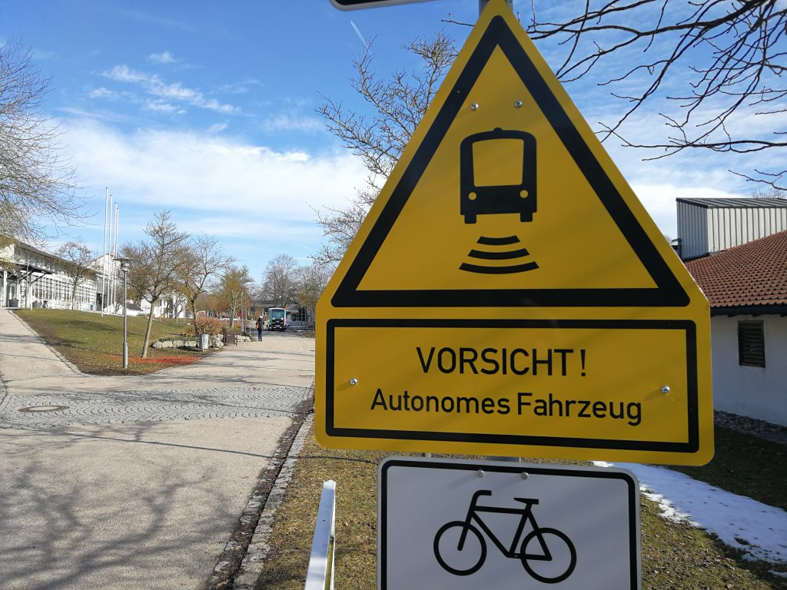
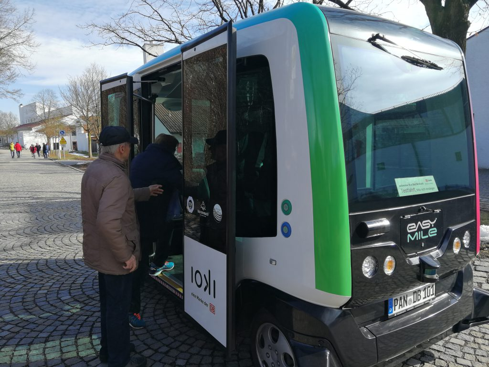
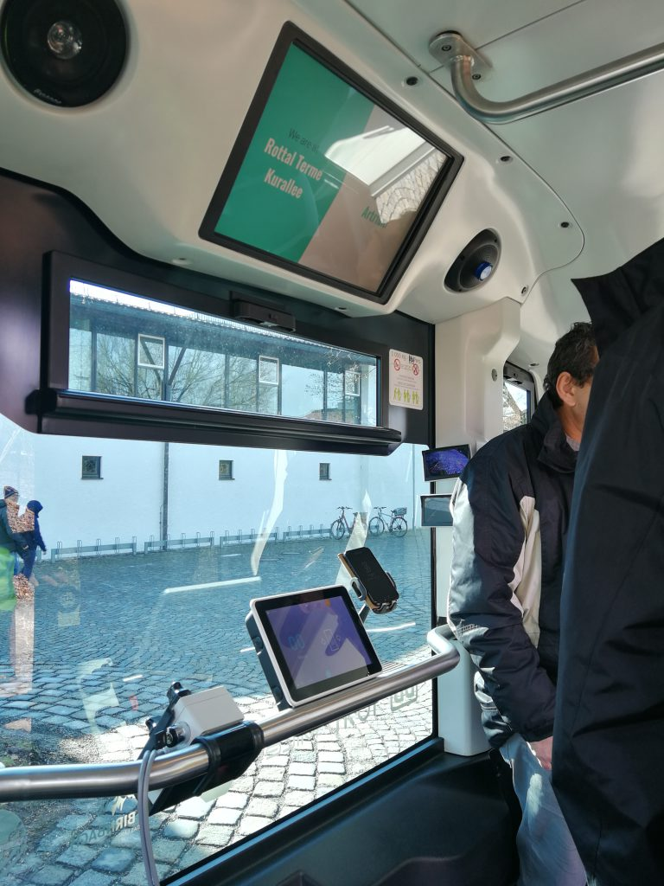

[Bad Birnbach](https://www.google.com/maps/place/84364+Bad+Birnbach/@48.4341204,12.9940911,12z/data=!3m1!4b1!4m5!3m4!1s0x4775b2c926e80a23:0x41d25a40937c600!8m2!3d48.4440584!4d13.0899962) – ein verschlafener Kurort mit [knapp 6000 Einwohnern](https://de.wikipedia.org/wiki/Bad_Birnbach). Doch wenn es um die Automatisierung des Personenverkehrs geht, avanciert die Marktgemeinde zur Speerspitze Deutschlands. Denn hier verkehrt seit Frühling 2017 der erste autonom fahrende Bus auf einer offiziellen ÖPNV Strecke. Da ich sowieso in der Nähe war, konnte ich mir das natürlich nicht entgehen lassen.

Wir warteten nicht lange an der Haltestelle Rottal Terme (meinten Sie: Therme?), da kam der Bus angebraust. Die erste Ernüchterung: er fuhr mit ca. 5-10 km/h nur minimal schneller als ein Fußgänger. Aber jeder fängt mal klein an. Die zweite Ernüchterung: nachdem wir eingestiegen sind fuhr der Bus bis zur nächsten Haltestelle Atrium zunächst nur auf einem Fußgängerweg. Das erklärt zwar die geringe Geschwindigkeit, aber stellt keine klassische ÖPNV-Verbindung dar. Die zweite Teilstrecke zur Endstation Neuer Marktplatz führte jedoch tatsächlich über ein Stück motorisiert befahrene Straße. Endlich konnte sich der Kleinbus im richtigen Verkehr beweisen. Und dies lief reibungslos, wenn auch nur mit Hilfe von zusätzlich angebrachten Fahrbahnmarkierungen.

Der bei nun geringfügig erhöhter Geschwindigkeit leicht vernommene Fahrtwind regte die Fantasie an. Welche Möglichkeiten bietet uns als Gesellschaft die autonome Mobilität? Erhöhte Sicherheit und Freiheit, ein organisierterer Verkehr, ein neues Fahrerlebnis. Die Gedanken waren kaum sortiert, da war die Fahrt leider schon zuende.

Der Bus stoppt automatisch an jeder Haltestelle und öffnet seine Tür. Zur Zeit pendelt er zwischen 3 Haltestellen hin und her. Zu Betriebsbeginn und -ende steuert er eine zusätzliche Haltestelle etwas außerhalb des Ortes an, wahrscheinlich übernachtet er dort.

Der Innenraum ist für 6 sitzende und ein paar stehende Passagiere ausgerichtet. Wie in einem modernen Bus üblich wird die aktuelle und zukünftige Haltestelle angezeigt. Ein kleinerer Bildschirm zeigt zusätzlich die momentane Geschwindigkeit und Bewegungsrichtung. Auf dem Bild sind außerdem ein Schaltgerät zur manuellen Steuerung, ein Handy und zwei Kamerabilder zu sehen. Dies ist aber dem Testbetrieb geschuldet. Ich denke, ohne Aufsicht werden diese Gerätschaften verschwinden.

Das Manövrieren des Fahrzeugs beruht auf den aggregierten Daten verschiedener Sensoren ([GPS](https://de.wikipedia.org/wiki/Global_Positioning_System), [Mobilfunknetz](https://de.wikipedia.org/wiki/GSM-Ortung), [Odometrie](https://de.wikipedia.org/wiki/Odometrie) und [Laserscanning](https://de.wikipedia.org/wiki/Elektrooptische_Entfernungsmessung)). Außerdem wird die Strecke zu Beginn einmal manuell per Joystick abgefahren. Dadurch ist die Bestimmung der Fahrzeugposition auf 2cm genau. Mit 360°-Abstandssensoren am Wagen können Hindernisse erkannt werden. Bei <50cm wird der Bus langsamer und kommt ab 10cm zum Stehen. Funktionierte gut. Problematisch war aber, dass er auf überholende Fahrzeuge, die sich für kurze Zeit nahe an der Busseite befanden, auch mit Bremsen reagiert hat.

Ein Inselprojekt wie eingangs beschrieben wird der Betrieb in Bad Birnbach für Deutschland aber nicht mehr lange sein. Unter dem sperrigen Projekttitel [nachfragegesteuerter-autonom-fahrender Bus](https://www.naf-bus.de/) dreht voraussichtlich ab 4. Mai 2019 ein mit Steuermitteln geförderter Bus der [EasyMile](https://easymile.com/) Konkurrenz [navya](https://navya.tech/) seine Runden im öffentlichen Bereich von Keitum, einem Ortsteil von Sylt (es bleibt also doch ein Inselprojekt).

Auch der Einsatz auf privatem Gelände kann helfen, die Gesellschaft auf die (schleichende) Revolution der Mobilität vorzubereiten. Prädestinierte Areale sind z.B. weitläufige Universitäts- oder Messegelände, wie auf dem [Greentec Campus](https://www.shz.de/lokales/nordfriesland-tageblatt/autonom-fahrender-bus-mit-emil-kostenlos-durch-die-zukunft-fahren-id22161282.html) praktiziert oder für den [Hessentag 2019](https://osthessen-news.de/n11555086/fahrerlose-shuttlebusse-zum-hessentag-2019-vertrag-auf-cebit-unterzeichnet.html) geplant.

###### Cover photo by jo3rn