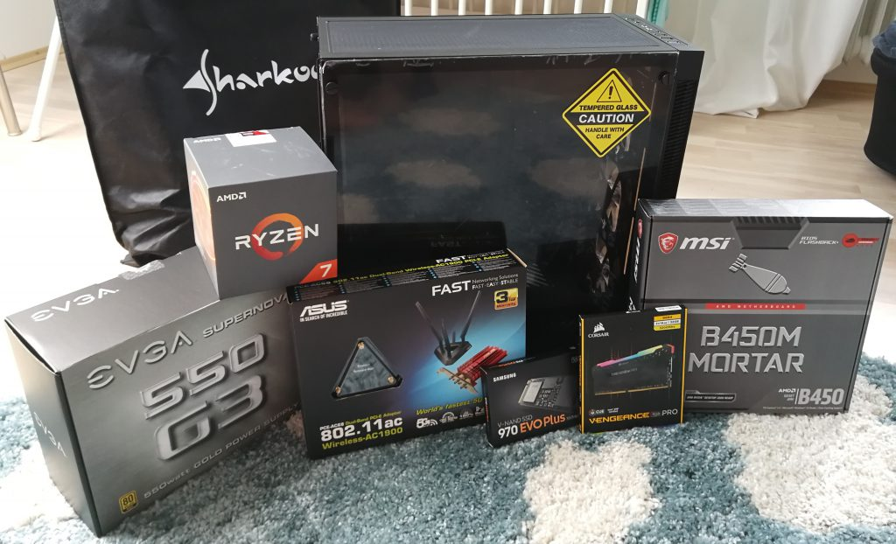

Als ich 2008 mein erstes Notebook (damals noch Laptop genannt) anschaffte, war der Hype groß. Dem lauten und sperrigen Tower neben dem Schreibtisch wurde immer weniger Aufmerksamkeit geschenkt. Bis 2010 habe ich unter der Woche in einer anderen Stadt gearbeitet und er war stets ein treuer Begleiter. Genau wie anschließend zu Beginn des Studiums auf dem Weg zur Uni. Dabei wurden allerdings die ersten Nachteile deutlich. Neben dem Gerät passte kaum noch etwas in den Rucksack ([außer Joghurt](https://www.amazon.de/dp/B0758VWJ1G/ref=as_li_tl?ie=UTF8&tag=jo3rn-21)). Röhrende Lüfter sorgten für Argwohn in Hörsaal und Bibliothek. Und die Rechenleistung ließ auch zu wünschen übrig. Nach knapp 3 Jahren kam deshalb ein neues Modell ins Haus WG-Zimmer. Der Neue war so handlich, dass er täglich transportiert wurde, was wiederum stark an seiner Lebensdauer zehrte. Das erste Gehalt nach dem Bachelor sorgte deshalb für den Dritten im Bunde. Fun-Fact am Rande: alle 3 waren von Acer. Und alle 3 haben gemeinsam, dass der eingangs erwähnte Tower sie alle überlebt hat. Er brummt nun fleißig im Arbeitszimmer meines Opas herum. Und das ohne viel Upgrades.

Das ist das schöne an Desktops. Selbst wenn sie in die Jahre kommen oder abrauchen, kann man meist nach dem Austausch eines Teils munter weitermachen. Diese Modularität beschränkt sich bei Notebooks meist auf Arbeitsspeicher und Festplatten. Mit viel Aufwand und wenig Auswahl können auch andere Teile gewechselt werden, davon würde ich aber abraten, da das Design des Kühlsystems nur auf die bestehende Konfiguration abgestimmt ist.

Inzwischen benötige ich die Mobilität eines Notebooks wesentlich seltener. Und für den Fall der Fälle kann das Acer Nr. 3 immer noch herhalten. Die meisten Aufgaben werden am Schreibtisch erledigt und dafür war es nun an der Zeit für einen neuen Desktop. In diesem Beitrag stelle ich den Auswahlprozess vor.

Zunächst ein Blick auf die benötigten Bauteile. Ich fange bei Null an, deshalb ist Folgendes zu besorgen:

- Gehäuse
- Motherboard
- Prozessor (auch CPU genannt)
- Arbeitsspeicher (auch RAM genannt)
- Grafikkarte
- Festplatte(n) (natürlich [SSD](https://jo3rn.de/magnetscheiben-zu-pflugscharen/))
- Lüfter
- Netzteil
- Kabel

Auf ein optisches Laufwerk habe ich verzichtet. Das wird eh kaum mehr gebraucht, und zur Not stöpsel ich eine [USB-Variante](https://amzn.to/2XF3Wx2) an. Der Platz ist außerdem für ein Diskettenlaufwerk vorgesehen. Just kidding.

Sonstige Peripherie ist vorhanden und wird erstmal nicht modernisiert um das Budget im Rahmen zu halten (trotz Geburtstagsgeschenke). Mein Monitor ist zwar unergonomisch und supportet nur DVI und VGA, aber für den Anfang wird es reichen. Mit [der Maus](https://amzn.to/2XzPx5c) bin ich im Office-Gebrauch zufrieden. Hier war mir nur wichtig, dass sie kabellos ohne Batteriewechsel läuft und leise klickt. Der hauptsächlich für Raspi-Projekte angeschafften [Tastatur mit Touchpad](https://amzn.to/2G386DX) wird bei nächster Gelegenheit eine größere beiseite gestellt, die auch nach längerer Benutzung ein angenehmes Gefühl hinterlässt. Außerdem steht neben dem Schreibtisch noch [ein Laserdrucker](https://amzn.to/2XDFUNQ), der gelegentlich einen neuen Toner benötigt, aber ansonsten seit vielen Jahren reibungslos läuft. Sollte er doch mal das Zeitliche segnen, ist die Gelegenheit da für einen heiß ersehnten WLAN-Drucker.

Nachdem ich diese Liste nun vor mir stehen sehe, vermute ich, dass dies ein sehr langer Beitrag werden wird. Zu jedem Bauteil möchte ich nämlich kurz erläutern, worauf ich bei der Auswahl geachtet habe. Da der Einsatzzweck entscheidend für die Zusammensetzung ist, hier meine funktionalen Anforderungen:

- Programmieren (professionell)
- Musik hören und schneiden (hobbymäßig)
- Alltägliches (Office, Surfen)

Ich bin kein video-editierender Designer oder ein [PC Master Race](https://pcmasterrace.org/) Gamer. Die Messlatte liegt also nicht so hoch. Da das Teil am Ende einen prominenten Platz im Arbeitszimmer beanspruchen wird, sollte es aber zusätzlich optisch etwas hermachen. Das Auge tippt mit. Und nun rein ins Vergnügen!

## Gehäuse (47,95€)

Selbstverständlich muss es ein Gehäuse sein, dass (teil-)durchsichtig ist. Nur so kann man die Schönheit der Schöpfung bewundern. Wie sich die Ventilatoren drehen und alles über zig Kabel irgendwie ineinander fließt und interagiert. Doch abgesehen vom Äußeren, was muss ein Case noch können außer rumstehen?

Da wäre z.B. der [Formfaktor](https://de.wikipedia.org/wiki/Formfaktor_(Computertechnik)), sprich: die Größe. Die vorgegebenen Bohrungen bestimmen, welches Motherboard eingeschraubt werden kann. Natürlich müssen auch alle anderen Bauteile reinpassen, daher sollte man sich vorher überlegen, was man verbaut (inkl. benötigter Kabel!). Dadurch beschränkt sich die Wahl des passenden Gehäuses automatisch auf eine bestimmte Größe.

Meine Wahl fiel auf das [Sharkoon TG5 RGB](https://amzn.to/2UJlk1k). Das konnte man bei einer Amazon-Aktion für knapp 50€ extrem günstig schießen, aber auch der Normalpreis ist in Ordnung. Eine Seitenwand und die Front sind aus getöntem Glas, sodass die vier bereits verbauten 120mm RGB-Lüfter gut zur Geltung kommen. Die Form ist auf ATX (305*244 mm) ausgelegt, aber Hauptplatinen in Mini-ITX oder Micro-ATX gehen auch rein. Der untere Teil bietet Schächte für zwei 2,5“ oder eine 3,5“ Festplatte(n), z.B. als Lagerplatz für selten genutzte Dateien. Für die schnellen Angelegenheiten werde ich zusätzlich eine Festplatte auf das Motherboard montieren.

## Motherboard (90,90€)

Was uns zum nächsten Bauteil bringt. Hier laufen alle Fäden zusammen. Das [MSI B450M Mortar](https://amzn.to/2ISowkv) Board besitzt die Anschlüsse, die für diesen Build notwendig sind und sieht recht schick aus. Lediglich sein kleines Format (Micro-ATX) lässt es im großen Gehäuse etwas verloren wirken.

Außerdem unterstützt es bis zu 64GB RAM. Da Entwicklungsumgebungen und manch ein Browser diese Ressource bevorzugt unzerkaut verschlingen, kann Luft nach oben für ein späteres Upgrade nicht schaden.

Das gute Stück kommt mit onboard WLAN. Warum das allerdings keine ausreichende Lösung ist, steht etwas weiter unten im Absatz zum WLAN-Adapter.

Wer einen guten Filter für Marketing-Gebrabbel hat, findet weitere Informationen zu dem Motherboard auf der [Seite des Herstellers](https://www.msi.com/Motherboard/B450M-MORTAR). Ein ganz nettes Feature, leider nur für Windows-Anwender, ist Mystic Light: ein Dashboard zum Steuern sämtlicher unterstützter LEDs inklusive diverser Animationen.

## Prozessor (243,99€)

Die Wahl eines AMD-Motherboards ebnete den Weg für den [AMD Ryzen 7 2700X](https://amzn.to/2ISTVDf) Prozessor. Härtester Konkurrent war der knapp 100€ günstigere [Ryzen 5 2600X](https://amzn.to/2Js8Jcb) der gleichen Generation mit Verzicht auf 2 Kerne und 4 Threads sowie einem nicht ganz so coolen Lüfter. Ich empfand die 8 Kerne des 7er dann aber doch als zukunftssicherer.

## Arbeitsspeicher (180,89€)

Beim RAM geht es nur um zwei Dinge: Größe und Übertragungsrate. Ein 32GB starker DDR4-SDRAM mit einer Taktfrequenz von 3200 MHz macht zwei dicke grüne Haken an beide Kriterien. Dass am [Corsair Vengeance RGB PRO 32GB](https://amzn.to/2J24pQK) auch noch LEDs montiert sind, ist reiner Zufall.

## Grafikkarte (83,99 €)

Das Motherboard besitzt einen DisplayPort 1.2 und HDMI 2.0 Ausgang. Da ich niedrige Grafik-Anforderungen habe, sollte dies ausreichen. So dachte ich beim ersten Zusammenbau des PCs. Bis beim Booten der Bildschirm schwarz blieb. Denn der Ryzen 2700X und fast alle anderen AMD Prozessoren [haben keinen Grafikkern](https://www.reddit.com/r/Amd/comments/8gflvb/ryzen_2700x_no_onboard_video/). Dass ich das über ein Reddit-Post herausfinden musste, liegt an der fehlenden Information auf der [offiziellen Produktseite](https://www.amd.com/en/products/cpu/amd-ryzen-7-2700x) (unter „Related Products“ steht allerdings bei allen Einträgen „Discrete Graphics Card Required“, das hätte mich hellhörig machen sollen). Also schnell noch die [MSI GeForce GT 1030 2GH LP OC](https://amzn.to/2U0L32u) bestellt und nachgerüstet. Somit verstaubt zumindest meine kleine aber feine Steam-Bibliothek nicht komplett.

## Festplatte (100,98€)

Wie bereits erwähnt suchte ich eine Systemplatte für das Motherboard im M.2 Format und eine oder zwei weitere Festplatten als Datengrab. Für ersteres fiel mein Auge auf die [Samsung 970 EVO](https://amzn.to/2X2aWmY) mit gutem Verhältnis von Preis und Performance. Ich entschied mich aber für den Nachfolger [970 EVO Plus](https://amzn.to/2WYfVFr), da hier die 500GB Variante sogar günstiger war. Die schließt direkt an den PCIe Bus an und garantiert flotten Datentransfer.

An den etwas langsameren SATA-Anschluss kommt eine Platte im Umfang von 2TB, wahrscheinlich die [Crucial MX500](https://amzn.to/2J2IYz9) oder etwas vergleichbares. Da ich nicht sofort zusätzlichen Speicher benötige, warte ich noch auf ein gutes Angebot.

## Lüfter

Wer während der Arbeit am PC nicht immer Kopfhörer tragen will, sollte zudem auf die Lüfter achten. Sind sie zu laut, kann sich ein Billigkauf ganz schnell rächen. Glücklicherweise greift hier wieder die Modularität, wodurch sich die Lüfter bei Bedarf auswechseln lassen. Ihr Luftzug sollte den Innenraum gut erfassen, sodass kein Hitzestau entsteht. Dies ist als Laie schwer zu überprüfen, man muss auf die Herstellerangaben vertrauen.

Im ausgewählten Gehäuse sitzen bereits 4 Lüfter mit jeweils einem RGB LED-Strip. Das Mainboard hat zwar nur zwei RGB-Schnittstellen, aber Sharkoon lieferte zum Gehäuse noch einen Hub, womit sich mehrere Strips an einem Bus bündeln lassen. Somit steuere ich die vorderen 3 Lüfter parallel und den hinteren separat an. Die Stromversorgung läuft bei allen über das Netzteil.

Des Weiteren war im Prozessorpaket der AMD Wraith Prism RGB Lüfter dabei, der die CPU kühlt. Dadurch sind für diesen Build ausreichend Lüfter vorhanden. Im Normalbetrieb vernimmt man nur ein zartes nicht weiter störendes Rauschen.

## WLAN-Adapter (56,90€)

Die ausgesuchte Hauptplatine kommt mit onboard-WLAN. Das funkt allerdings nur im alten 802.11a Standard (max. Bruttodatenrate 54 MBit/s). Da ein Umzug ansteht und die LAN-Anschlüsse noch nicht feststehen, ist der WLAN-Adapter [Asus PCE-AC68](https://amzn.to/2WYhEup) verbaut. So bin ich auf jeden Fall mit 802.11ac am Internet. Wenn möglich wird aber ein Kabel verlegt, das ist zuverlässiger und schleuniger als über Funk.

## Netzteil (77€)

Vor der Wahl eines Netzteils sollte man die anderen Komponenten ausgesucht haben, um ein Gerät passend zum Energiehunger zu wählen. Mit dem [PC-Part-Picker](https://pcpartpicker.com/) kann man die nötige Leistung abschätzen, in dem man sein Setup zusammenklickt (das in diesem Artikel besprochene findest du [hier](https://pcpartpicker.com/list/MdfQXP)). Somit komme ich auf 289 Watt. Natürlich lässt sich das auch aus den einzelnen Datenblättern ablesen und addieren, doch das ist weniger komfortabel. Zudem informiert der PC-Part-Picker über auftretende Kompatibilitätsprobleme der ausgewählten Teile.

Nun sollte man kein Netzteil aussuchen, dass gerade so die errechnete Leistung erbringt. Denn dadurch kommt man schnell in die Situation ein neues Netzteil kaufen zu müssen. Zwei Faktoren sind zu bedenken:

- Tastatur/Maus, sonstige USB-Geräte und Monitore
- Eventuelle Upgrades und Umbaumaßnahmen, z.B. später eine zusätzliche Festplatte oder bessere Grafikkarte

Die Entscheidung fiel deshalb auf die [EVGA SuperNOVA](https://amzn.to/2X52LSm), eine PSU (Power Supply Unit) in der 550 Watt Version. Es gibt bei den PSUs die [80+ Effizienzklassen](https://de.wikipedia.org/wiki/80_PLUS), welche deklarieren wie weit der Wirkungsgrad über 80% liegt (Bronze bis Titanium). Ein höherer Wirkungsgrad spart zwar laufende Stromkosten, geht allerdings meist mit höheren Anschaffungskosten einher. Somit muss man sich überlegen, ob sich eine höhere Effizienzklasse rein kostentechnisch überhaupt rentiert.

## Kabel

Genau wie bei den Lüftern werden alle benötigten Kabel bereits mit den Produkten geliefert, sodass keine weiteren Kabel angeschafft werden müssen (außer ggf. ein 3fach-Stecker). Die Kabel ließen sich gut verlegen. Einzige Frickelarbeit waren die Anschlüsse ans Netzteil, da ich es als erstes eingebaut habe. Das kann man umgehen, indem man die Kabel für Stromversorgung der Komponenent vorher anschließt.

## Betriebssystem

In der Rubrik „OS-Support“ erscheint beim [Prozessor](https://www.amd.com/en/products/cpu/amd-ryzen-7-2700x) zwar nur Ubuntu, jedoch basiert mein Favorit [Linux Mint](https://www.linuxmint.com/) auf dieser Distribution, weshalb ich mit keinen Komplikationen gerechnet habe. Und so war es. Die Treiberverwaltung lief reibungslos. Initial habe ich den PC per Kabel mit dem Router verbunden, um für WLAN Adapter und Grafikkarte die entsprechenden Treiber herunterzuladen.

Beim ersten Soundcheck kratzte es in Lautsprechern und Kopfhörer. Ich befürchtete schlimmes und ging bereits auf die Fehlersuche, als nach 10 Minuten plötzlich der Ton klar wurde und sich das Problem von selbst erledigte.

## Gesamtpreis

Somit kommen wir auf einen Gesamtpreis von 882,60€. Bitte beachtet, dass ich hier zwar die Amazon Affiliate-Links zu den Produkten angebe, man aber oft über Preisvergleiche (z.B. via [idealo](https://www.idealo.de/)) den ein oder anderen Euro weniger ausgeben kann. Neben dem Verzicht auf RGB-Klimbim ist taktisches Warten eine weitere Sparmöglichkeit ohne Einbußen der Leistung in Kauf zu nehmen. Zum Beispiel hat Arbeitsspeicher anscheinend den Crypto-Boom überdauert und wird wieder [stetig günstiger](https://pcpartpicker.com/trends/price/memory/). Auch kann der Start einer neuen Prozessorserie den Preis der Vorgänger deutlich nach unten drücken. Ich selbst habe ca. 2 Monate lang Preise beobachtet und jeweils zu einem günstigen Zeitpunkt zugeschlagen.

## Zusatz: Monitor

Für meinen alten Monitor schlug nun doch sein letztes Stündchen. Denn einen DVI oder VGA Anschluss wollte ich mir allein für Legacy-Support nicht mehr ins Haus holen. Genau so wenig wie ihn mit teuren Adaptern künstlich am Leben zu halten.

Erster Schritt also den alten auf ebay-Kleinanzeigen gestellt und anschließend im nächsten MediaMarkt einen günstigen 24 Zoll Monitor mit DisplayPort geschnappt. Langfristig wird dieser dann per Daisy Chain an den [Philips 242B7QPTEB](https://amzn.to/2ZtV7Hh) gehängt und sein Dasein als Zweitbildschirm fristen.