Alle Jahre wieder gehe ich nicht auf den [Chaos Communication Congress](https://de.wikipedia.org/wiki/Chaos_Communication_Congress), aber schaue mir gerne im Nachhinein die Wiederholungen an. Glücklicherweise stellt der [CCC](https://de.wikipedia.org/wiki/Chaos_Computer_Club) auf [media.ccc.de](https://media.ccc.de/) alle Aufzeichnungen frei zur Verfügung. Es folgt eine kurze Liste der für mich sehenswerten Talks. Obwohl die Konferenz nun gut einen Monat her ist, habe ich längst nicht jeden geschaut. Daher sei es mir verziehen, wenn es die ein oder andere Perle nicht in diese Aufzählung geschafft hat.

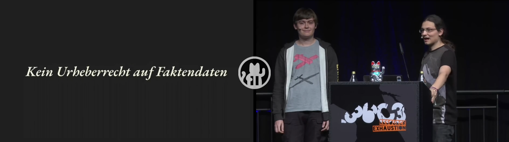
## [Verkehrswende selber hacken](https://media.ccc.de/v/36c3-10881-verkehrswende_selber_hacken) ([YouTube](https://www.youtube.com/watch?v=WhgRRpA3b2c))

Wer das Zukleistern von Innenstädten mit Fahrrädern und E-Scootern nicht als Ideallösung der Zukunft der Mobilität betrachtet, dem sei dieser Vortrag ans Herz gelegt. Das Aggregieren von Verkehrsdaten des öffentlichen Raums ist die Grundlage erheblichen Optimierungspotentials. Doch dazu müssen diese Daten offen liegen. [robbi5](https://twitter.com/robbi5) und [ubahnverleih](https://twitter.com/ubahnverleih) zeigen, wie es gehen könnte.

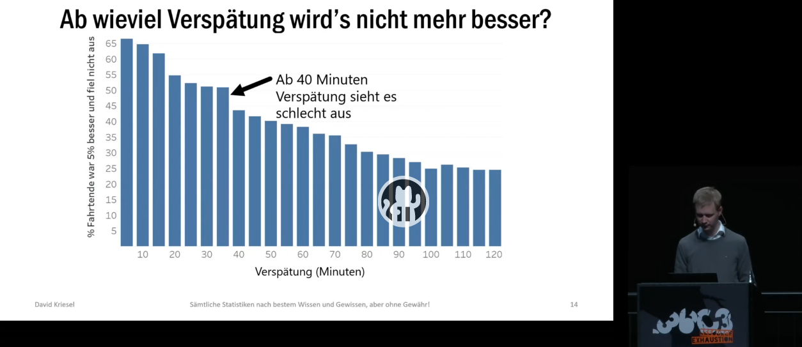
## [BahnMining - Pünktlichkeit ist eine Zier](https://media.ccc.de/v/36c3-10652-bahnmining_-_punktlichkeit_ist_eine_zier) ([YouTube](https://www.youtube.com/watch?v=0rb9CfOvojk))

Apropos Öffis: [David Kriesel](http://www.dkriesel.com/), der schon auf vergangenen C3s brilliante Talks ablieferte ([SpiegelMining](https://media.ccc.de/v/33c3-7912-spiegelmining_reverse_engineering_von_spiegel-online), [Traue keinem Scan](https://media.ccc.de/v/31c3_-_6558_-_de_-_saal_g_-_201412282300_-_traue_keinem_scan_den_du_nicht_selbst_gefalscht_hast_-_david_kriesel)), hat nun mit seiner Analyse der Deutschen Bahn den Hattrick geschnürt. Hierzu sammelte er fast alle in 2019 stattgefundenen Zughalte an deutschen Fernbahnhöfen. Unaufgeregt und neutral präsentiert er grafisch aufbereitete Informationen aus dieser immensen Datenflut. An passender Stelle bietet er einen Einblick in das Feld der Data Science, indem er seine Herangehensweise und Überlegungen genauer beleuchtet.

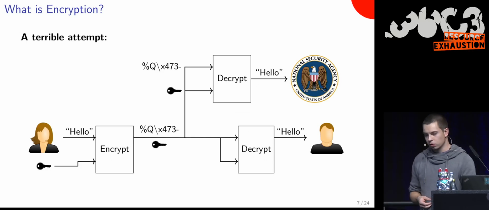
## [[Englisch] Cryptography demystified - An introduction without maths](https://media.ccc.de/v/36c3-10627-cryptography_demystified) ([YouTube](https://www.youtube.com/watch?v=t4BQHafLafI))
Der Speaker [OOTS](https://twitter.com/AusDemStrom) erklärt kryptographische Vorgänge (Verschlüsselung, Authentifizierung, Zertifizierung) bewusst ohne dabei auf die zugrunde liegenden mathematischen Verfahren einzugehen. Exzellent geeignet, um in die Thematik einzusteigen. Diesen Vortrag hätte ich mir während des Studiums gewünscht.

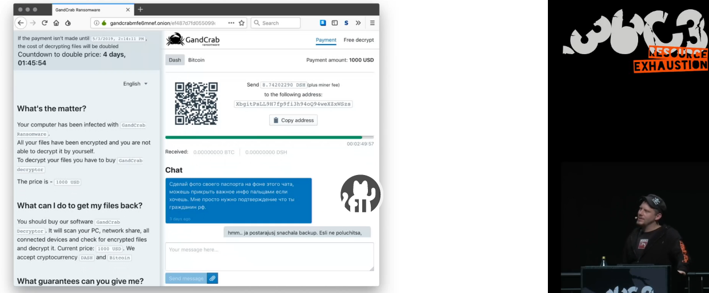
## [Hirne Hacken - Menschliche Faktoren der IT-Sicherheit](https://media.ccc.de/v/36c3-11175-hirne_hacken) ([YouTube](https://www.youtube.com/watch?v=BreKdM7CKnY))

Von [Linus Neumanns](https://twitter.com/linuzifer) Vortrag war ich zunächst etwas enttäuscht. Denn er beginnt mit dem Vorkauen der hinlänglich bekannten Arten, wie Kriminelle die IT-Systeme über das Einfallstor Mensch zu kompromittieren versuchen. Allerdings streut er frische und unterhaltsame Elemente ein, wie z.B. den Chatverlauf mit dem "Service Desk" einer Hackergruppe (Screenshot), weshalb ich den Vortrag gerne in die Liste aufnehme. Zudem werden am Ende die Ergebnisse eines größer angelegten Phishing-Feldversuchs zur Steigerung der Security Awareness vorgestellt - mit durchaus interessanten Schlussfolgerungen.

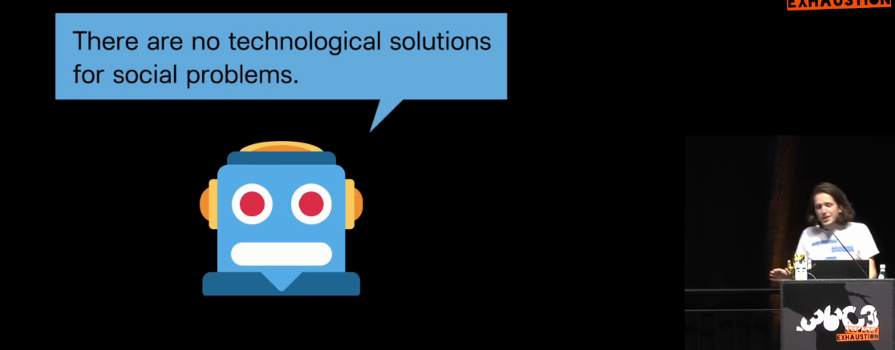
## [[Englisch] Wohnungsbot: An Automation-Drama in Three Acts - A media-art project which automates the search for flats in Berlin and challenges automation narratives](https://media.ccc.de/v/36c3-10988-wohnungsbot_an_automation-drama_in_three_acts) ([YouTube](https://www.youtube.com/watch?v=wmWXXRdQjTU))

[Clemens Schöll](https://github.com/neopostmodern) programmierte sich einen Web Crawler, um sich im umkämpften Berliner Wohnungsmarkt einen Vorteil zu verschaffen. Das ist an sich schon Aufhänger genug für einen Talk, doch in diesem Fall nur die Basis für eine weiterführende philosophische Betrachtung von Für und Wider der Automatisierung im Allgemeinen.

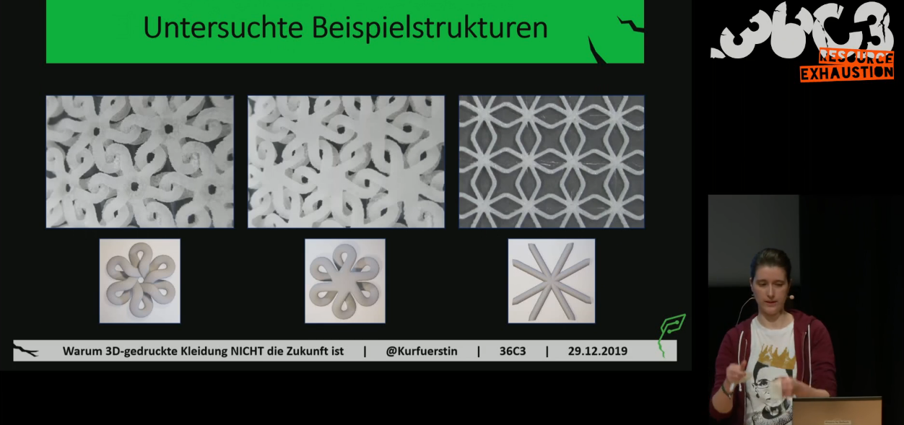
## [Warum 3D-gedruckte Kleidung NICHT die Zukunft ist](https://media.ccc.de/v/36c3-10672-warum_3d-gedruckte_kleidung_nicht_die_zukunft_ist) ([YouTube](https://www.youtube.com/watch?v=A4LfB2ntEaY))

Ohne zu spoilern sollte der Titel eigentlich heißen: warum 3D-gedruckte Kleidung NOCH nicht die Zukunft ist. Denn [Kurfuerstin](https://twitter.com/Kurfuerstin) beschreibt zwar ausführlich die Nachteile, die Kleidung aus dem Drucker gegenüber herkömmlich hergestellten Klamotten hat, schließt aber keineswegs einen zukünftigen Technologiedurchbruch aus. Was für die Aufbereitung des Talks spricht: Ich als Laie sowohl im 3D-Druck als auch der Bekleidungstechnik habe nie den Faden verloren (pun intended) und einiges dazu gelernt.

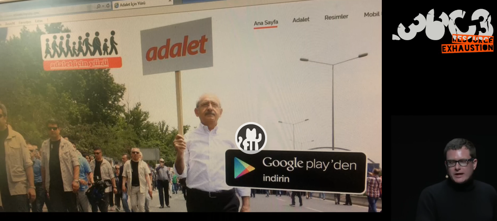
## [Finfisher verklagen - Rechtsbrüche beim Export von Überwachungssoftware](https://media.ccc.de/v/36c3-11217-finfisher_verklagen) ([YouTube](https://www.youtube.com/watch?v=kvGIY0JYg0k))

Wenn Staatstrojaner die Freiheit gefährden, tritt [Ulf Buermeyer](https://twitter.com/vieuxrenard) und die [Gesellschaft für Freiheitsrechte](https://freiheitsrechte.org/) auf den Plan und verklagt die Geschäftsführung der Entwicklerfirma. Gemeinsam mit [Thorsten Schröder](https://twitter.com/__ths__)  wird gezeigt, wie sie die Verwendung der Software u.a. in der Türkei nachweisen und die Beteiligung der Firma belegen. Dabei schlachten sie nicht nur Samples einer Android App forensisch aus, sondern erzählen auch die zugrunde liegende Geschichte, die zeigt, dass ein Trojaner und eine Kalaschnikow gar nicht so verschieden sind.

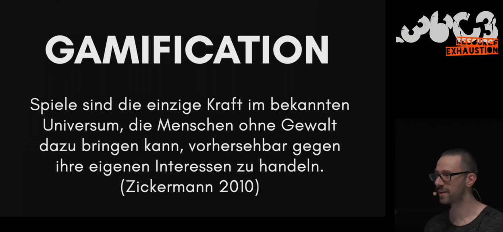
## [Let’s play Infokrieg - Wie die radikale Rechte (ihre) Politik gamifiziert](https://media.ccc.de/v/36c3-10639-let_s_play_infokrieg) ([YouTube](https://www.youtube.com/watch?v=8A9ZoC7hyoY))

[Arne Vogelgesang](https://twitter.com/foyglgezang) beschreibt die Konsequenzen der spielerischen Aufmüpfigkeit der (rechten) Trollszene. Wenn sich die Online-Community von den Schreibtischen erhebt, führt das nicht immer nur zu ulkigen Auswüchsen, sondern birgt reale Gefahren.

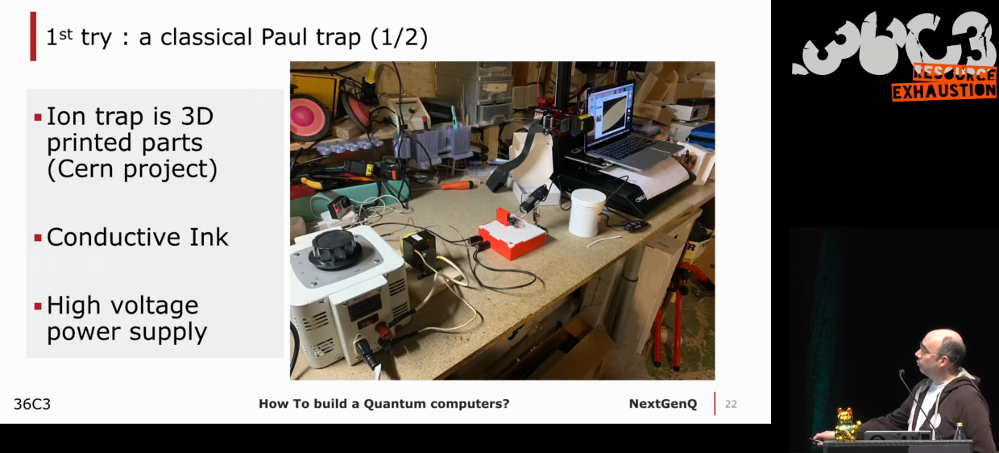
## [[Englisch] Build you own Quantum Computer @ Home - 99% of discount - Hacker Style !](https://media.ccc.de/v/36c3-10808-build_you_own_quantum_computer_home_-_99_of_discount_-_hacker_style) ([YouTube](https://www.youtube.com/watch?v=w6O7K7Ij2Rk))

Der Maker [Allain Yann](https://twitter.com/MeAllainYann) baut in seiner Garage einen Quantencomputer und lässt uns an seinen Fort- und Rückschritten teilhaben. Sein Projekt ist zwar nicht fertig gestellt, aber macht das abstrakte Quantenthema etwas greifbarer.

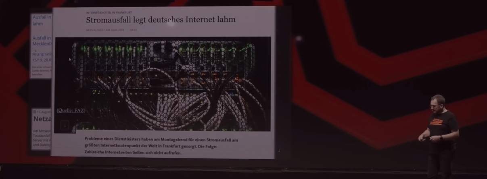
## [Datacenter - was wir wissen sollten (und trotzdem oft nicht erfahren)](https://media.ccc.de/v/36c3-126-datacenter-was-wir-wissen-sollten-und-trotzdem-oft-nicht-erfahren-) ([YouTube](https://www.youtube.com/watch?v=7Q3Lzn6ZCmw))
So gut wie jeder Bürger hat täglich bewusst oder unbewusst Kontakt mit mehreren Rechenzentren. Für [Günter Eggers](https://twitter.com/guenter_eggers) ist es unerklärlich, wieso die Bedeutung von Datacentern für die Gesellschaft aktuell kaum thematisiert wird. Er mahnt insbesondere die Politik den Status als kritische Infrastruktur mit vehementeren Maßnahmen zu untermauern. Nebenbei gibt er auch eine anfängerfreundliche Einführung in die allgemeine Beschaffenheit von Rechenzentren.

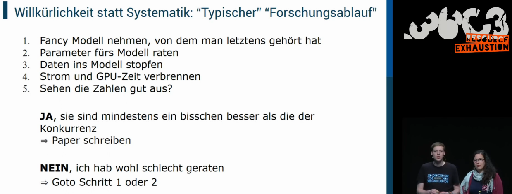
## [Der Deep Learning Hype - Wie lange kann es so weitergehen?](https://media.ccc.de/v/36c3-11006-der_deep_learning_hype) ([YouTube](https://www.youtube.com/watch?v=UMAXI3lvUU8))

[Nadja Geisler](https://twitter.com/_ngeisler) und [Benjamin Hättasch](https://twitter.com/bhaettasch) zeigen, warum Deep Learning zwar oft glänzt, aber nicht immer Gold ist. Dabei setzen sie sich hauptsächlich mit der Anwendung von Deep Learning in der Wissenschaft auseinander, reflektieren darüber hinaus aber auch gesellschaftliche und ökologische Aspekte.

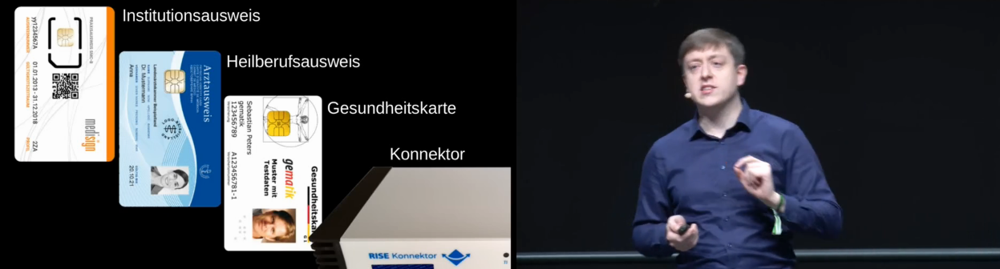
## ["Hacker hin oder her": Die elektronische Patientenakte kommt!](https://media.ccc.de/v/36c3-10595-hacker_hin_oder_her_die_elektronische_patientenakte_kommt) ([YouTube](https://www.youtube.com/watch?v=q6l_B2fgJjM))
Als Endkunde in der Gesundheitsbranche wird man häufig mit analogen Prozessen konfrontiert. Umständlich und zeitraubend sammelt und verteilt man alle möglichen Formulare und Befunde. Die elektronische Patientenakte soll die digitale Revolution bringen. Doch [Martin Tschirsich](https://twitter.com/mtschirs), [Dr. André Zilch](https://www.linkedin.com/in/andré-dr-zilch-83875413/) und Dr. med. Christian Brodowski zeigen, welche Kinderkrankheiten noch behandelt werden müssen. Sie präsentieren, wie sie alle vier Möglichkeiten (siehe Screenshot) der Authentifizierung nutzen konnten, um unerlaubter Weise Zugriff auf eine Patientenakte zu erlangen.

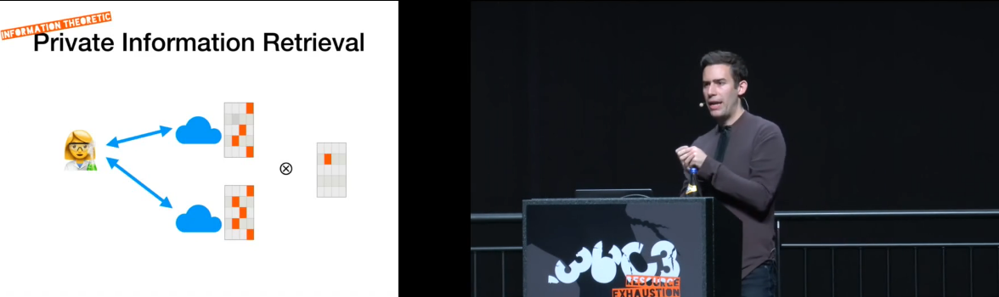
## [[Englisch] What's left for private messaging?](https://media.ccc.de/v/36c3-10565-what_s_left_for_private_messaging) ([YouTube](https://www.youtube.com/watch?v=ezA01rs7n3s))

Wer beim Versenden von Nachrichten die Privatsphäre in den Vordergrund stellt, muss aktuell Einbußen bei Benutzerfreundlichkeit, Kosten, Netzwerkeffekten oder Praktikabilität in Kauf nehmen. [Will Scott](https://twitter.com/willscott) erklärt, warum das so ist und welche jüngsten Entwicklungen die Situation verbessern könnten.

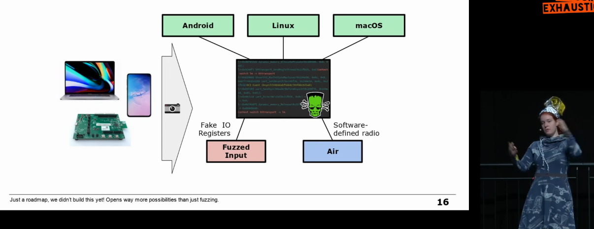
## [[Englisch] All wireless communication stacks are equally broken](https://media.ccc.de/v/36c3-10531-all_wireless_communication_stacks_are_equally_broken) ([YouTube](https://www.youtube.com/watch?v=AzLjN_WEKLI))
Kein typischer Foundations-Talk, aber spannend für jene, die sich für drahtlose Kommunikation interessieren. [Jiska](https://twitter.com/naehrdine) beschreibt, wie sie verschiedene Chips hackt und von dort aus erweiterten Zugriff über Treiber und das Betriebssystem bis hin zu anderen Hardware-Chips erlangt. Der Großteil dreht sich um ihr Spezialgebiet Bluetooth.

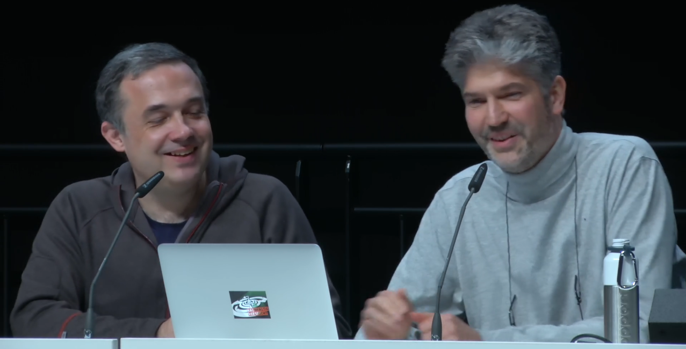
## [Security Nightmares 0x14 - Was Sie schon immer nicht darüber wissen wollten wer Ihre Geräte wirklich kontrolliert](https://media.ccc.de/v/36c3-11164-security_nightmares_0x14) ([YouTube](https://www.youtube.com/watch?v=byZBO7EHnFQ))

In gewohnt ruhiger, abgeklärter Manier tauschen sich [Frank Rieger](https://twitter.com/frank_rieger) und Ron zum 20. Mal über Cyber-Themen des letzten Jahres und Jahrzehnts aus. Zugegebenermaßen ist der Vortrag gespickt mit Insidern und eigensinnigem Humor und somit etwas gewöhnungsbedürftig. Wer nach 10 Minuten nicht damit klar kommt, schaltet besser ab, denn es wird nicht besser.

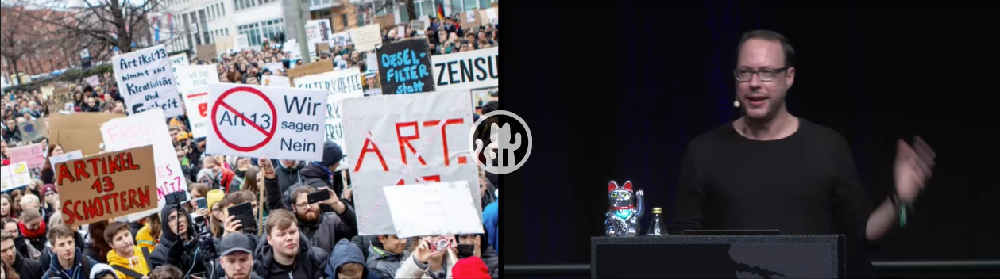
## [Der netzpolitische Jahresrückblick - War alles schon mal besser](https://media.ccc.de/v/36c3-10963-der_netzpolitische_jahresruckblick) ([YouTube](https://www.youtube.com/watch?v=GgCcQLe_aqE))

Ein weiteres wiederkehrendes Element ist die Jahresbilanz von [netzpolitik.org](https://netzpolitik.org/). Der Chefredakteur [Markus Beckedahl](https://twitter.com/netzpolitik) gibt in diesem Talk, wie sich vermuten lässt, einen Abriss über die netzpolitischen Ereignisse in 2019. Ein kurzweiliges Unterfangen mit einigen "Ach, das war auch dieses Jahr"-Momenten.

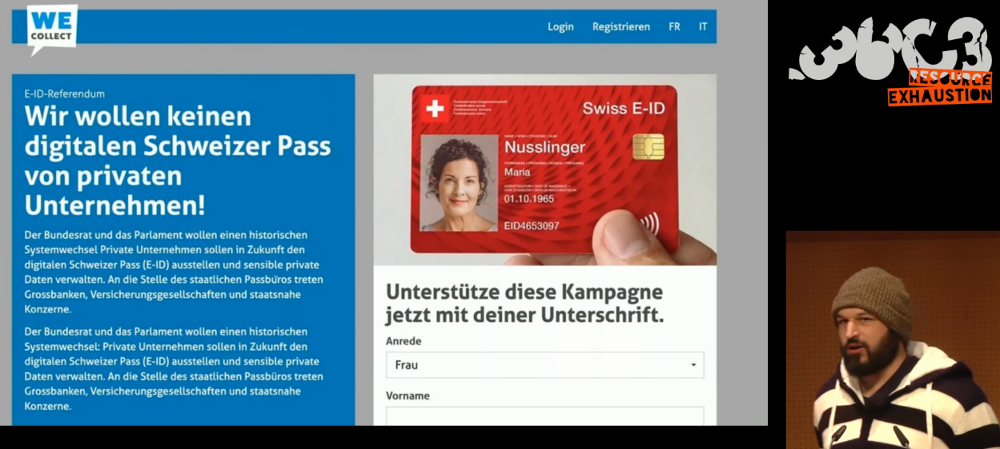
## [Schweiz: Netzpolitik zwischen Bodensee und Matterhorn - E-ID, E-Voting, Netzsperren und andere netzpolitische Schauplätze](https://media.ccc.de/v/36c3-10892-schweiz_netzpolitik_zwischen_bodensee_und_matterhorn) ([YouTube](https://www.youtube.com/watch?v=B6wNjp5ZNhY))
Analog tritt die [Digitale Gesellschaft](https://www.digitale-gesellschaft.ch/) für die Netzpolitik der Schweiz auf den Plan. [Patrick Stählin](https://twitter.com/thepacki) und seine Kollegen resümieren die wichtigsten Geschehnisse des vergangenen Jahres. Dabei weisen die Eidgenossen viele Parallelen zu Deutschland auf.

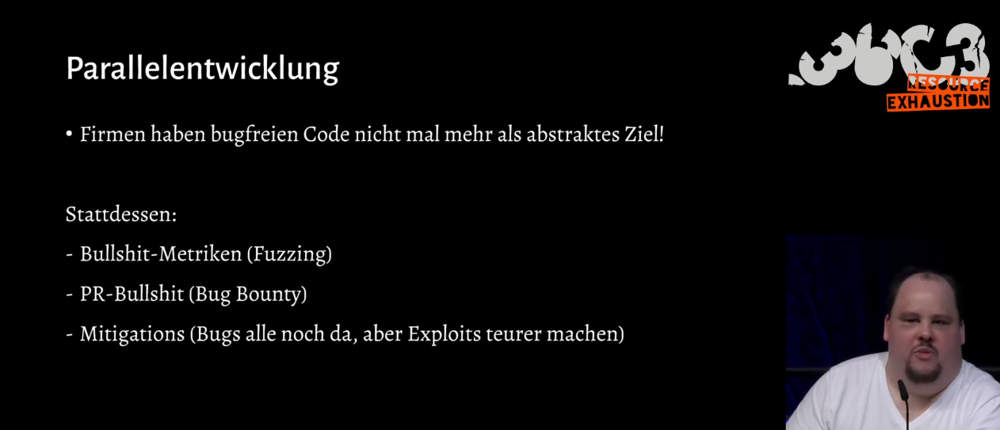
## [Das nützlich-unbedenklich Spektrum](https://media.ccc.de/v/36c3-10608-das_nutzlich-unbedenklich_spektrum) ([YouTube](https://www.youtube.com/watch?v=31xA9p3pYE4))

[Felix von Leitner](http://blog.fefe.de/) fragt sich in seinem Vortrag, ob man Software bauen kann, die nützlich und unbedenklich ist. Dieser Talk bietet verschiedene interessante Denkanstöße für Softwareentwickler. Bei Fefes sympathisch einnehmender Art vergisst man allerdings schnell, dass sein Vortrag auf einer Einzelmeinung und keiner wissenschaftlichen Abhandlung fußt. Nicht jede steile These sollte daher für bare Münze genommen werden.

### Honorable Mentions:
- Das [Hacker Jeopardy](https://media.ccc.de/v/36c3-11177-hacker_jeopardy) ([YouTube](https://www.youtube.com/watch?v=_BDnJAG4mlE)) ist für mich normalerweise stets ein gelungener Ausklang meines persönlichen CCC-Aufzeichnungsmarathon. Dieses Jahr war ich leider etwas enttäuscht, aufgrund der anfänglichen technischen Pannen, der gesichtslosen Alu-Burka und teilweise mäßig originellen Fragen (oder sagt man Antworten?).
- Technikaussetzer gibt es auch bei der Präsentation zum [KGB Hack](https://media.ccc.de/v/36c3-11031-the_kgb_hack_30_years_later) ([YouTube](https://www.youtube.com/watch?v=3vECl4oLCZA)), wodurch man sich leider nie richtig von der Story fesseln lassen kann.

###### Cover photo by <a style="background-color:black;color:white;text-decoration:none;padding:4px 6px;font-family:-apple-system, BlinkMacSystemFont, &quot;San Francisco&quot;, &quot;Helvetica Neue&quot;, Helvetica, Ubuntu, Roboto, Noto, &quot;Segoe UI&quot;, Arial, sans-serif;font-size:12px;font-weight:bold;line-height:1.2;display:inline-block;border-radius:3px" href="https://unsplash.com/@headwayio?utm_medium=referral&amp;utm_campaign=photographer-credit&amp;utm_content=creditBadge" target="_blank" rel="noopener noreferrer" title="Download free do whatever you want high-resolution photos from Headway"><svg xmlns="http://www.w3.org/2000/svg" style="height:12px;width:auto;position:relative;vertical-align:middle;top:-2px;fill:white" viewBox="0 0 32 32"><path d="M10 9V0h12v9H10zm12 5h10v18H0V14h10v9h12v-9z"></path></svg>Headway</a>