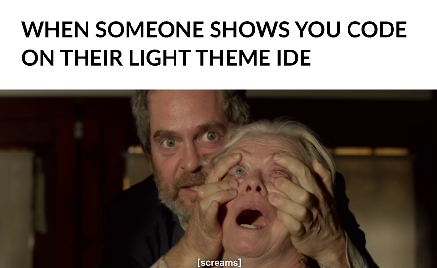
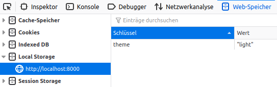

Der Mond ist aufgegangen. Er schwebt lautlos über dieser Seite in der rechten oberen Ecke (oder auf kleinen Screens in der rechten unteren). Mit einem Klick tauchst du ein in die tiefe Nacht. Ein Klick zurück und du bräunst dich wieder vor deinem Bildschirm.

Dark Mode ist omnipräsent. Einzug erhielt er zuerst bei Programmen, die viel Bildschirmzeit beanspruchen, wie [Visual Studio Code](https://code.visualstudio.com/docs/getstarted/themes) oder [Photoshop](https://blogs.adobe.com/jkost/2019/01/choosing-a-color-theme-in-photoshop-cc.html), ja sogar [Microsoft Office](https://support.office.com/en-us/article/change-the-look-and-feel-of-office-63e65e1c-08d4-4dea-820e-335f54672310). Es folgten stark frequentierte Webseiten wie [Twitter](https://twitter.com/), [Reddit](https://www.reddit.com/) oder [Twitch](https://www.twitch.tv/). Unternehmen wie [Netflix](https://www.netflix.com/de/) haben sich einfach von Grund auf für dunkle Farben entschieden. Wikipedia zog noch nicht mit, aber hostet immerhin einen [Artikel](https://en.wikipedia.org/wiki/Light-on-dark_color_scheme) darüber. Apple und Google brachten mit den aktuellen Betriebsversionen [iOS 13](https://support.apple.com/en-us/HT210393#13) und [Android 10](https://developer.android.com/about/versions/10/features#darktheme) den systemweiten Dark Mode in die Handys.

Wenn auch keine Einigkeit über ergonomische Auswirkungen herrscht, so hilft es bei OLED Displays den [Stromverbrauch zu reduzieren](https://www.sueddeutsche.de/digital/smartphone-akkulaufzeit-dark-mode-1.4224875). Und zumindest anekdotenhaft kann ich in meinem Bekanntenkreis etliche Verfechter (sprich: Glaubenskrieger) des dunklen Designs ausmachen. Menschen, die über [solche Memes](https://i.imgur.com/1Xvs3r3.png) lachen:

Und um es nicht unerwähnt zu lassen: Why do programmers prefer dark mode? Because light attracts bugs.

Stoße ich beim Surfen im Internet mal auf eine weiße Wand, mache ich mir das [Dark Reader Addon](https://darkreader.org/) zu Nutze. Doch automatisierte Konvertierungen liefern nicht immer optimale Ergebnisse. Deshalb entschied ich mich dazu, meine Seite für jeden Geschmack in dunkel (default) und hell anzubieten. Nun kannst du selbst entscheiden. Damit du beim nächsten Aufruf dieser Homepage nicht aus allen Wolken fällst, wird deine Präferenz im sogenannten [local storage](https://www.w3schools.com/html/html5_webstorage.asp) gespeichert. Das sieht so aus (Triggerwarning: der folgende Screenshot ist nicht im Dark Mode):

Leider funktioniert das immer nur für den selben Browser, das heißt unter Umständen fällst du doch aus allen Wolken. Aber du weißt ja jetzt, wo du das Theme ändern kannst.

Lediglich den Hintergrund einzuschwärzen war mir aber etwas zu banal. Im Zuge der Umgestaltung änderte ich deshalb auch gleich das Farbschema. Dieses basierte bislang auf dem [Basisprojekt](https://github.com/greglobinski/gatsby-starter-hero-blog), auf das diese Homepage aufsetzt. Nun ist es "gebrandet". Bei der Farbauswahl orientierte ich mich am [Farbsystem von Material Design](https://material.io/design/color/). Es gibt eine Primärfarbe (braun) sowie eine Sekundärfarbe (grün). Diese werden je nach Theme in verschiedenen Varianten eingesetzt. Bei der Verwendung eines [Dark Themes](https://material.io/design/color/dark-theme.html#) sind es eher hellere Abstufungen, da der Hintergrund dunkel ist. Wenn wichtige Elemente ein zu hohes Deckvermögen gegenüber ihrem Hintergrund haben, schränkt das die Erkennbarkeit ein. Dies ist nur ein Kriterium der [Barrierefreiheit im Internet](https://www.w3.org/WAI/fundamentals/accessibility-intro/). Webentwickler sollten sich immer vor Augen halten, dass nicht jeder eine Seite so betrachtet und benutzt, wie man selbst.

###### Cover photo by <a style="background-color:black;color:white;text-decoration:none;padding:4px 6px;font-family:-apple-system, BlinkMacSystemFont, &quot;San Francisco&quot;, &quot;Helvetica Neue&quot;, Helvetica, Ubuntu, Roboto, Noto, &quot;Segoe UI&quot;, Arial, sans-serif;font-size:12px;font-weight:bold;line-height:1.2;display:inline-block;border-radius:3px" href="https://unsplash.com/@ninoliverpool?utm_medium=referral&amp;utm_campaign=photographer-credit&amp;utm_content=creditBadge" target="_blank" rel="noopener noreferrer" title="Download free do whatever you want high-resolution photos from Nino Yang"><svg xmlns="http://www.w3.org/2000/svg" style="height:12px;width:auto;position:relative;vertical-align:middle;top:-2px;fill:white" viewBox="0 0 32 32"><path d="M10 9V0h12v9H10zm12 5h10v18H0V14h10v9h12v-9z"></path></svg>Nino Yang</a>